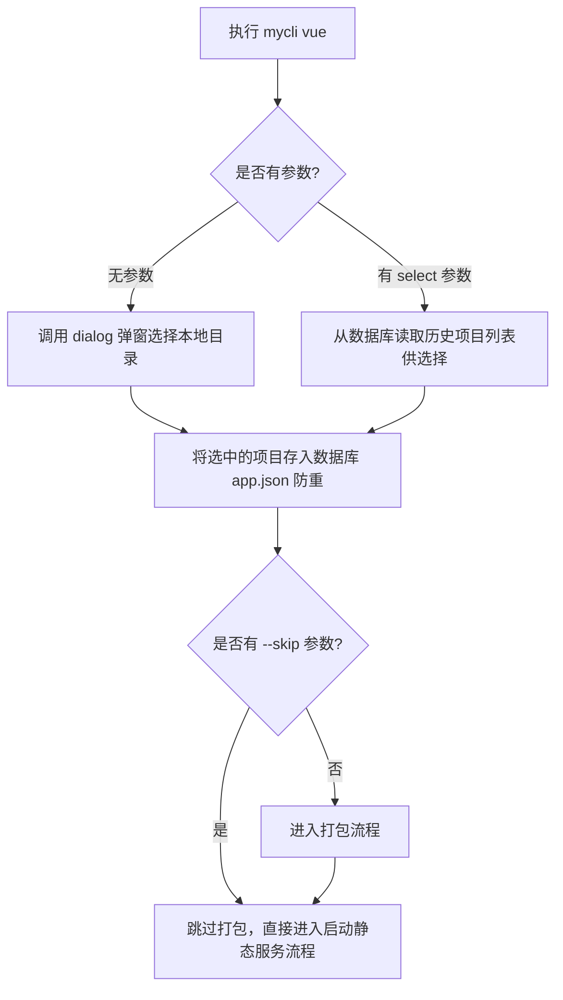
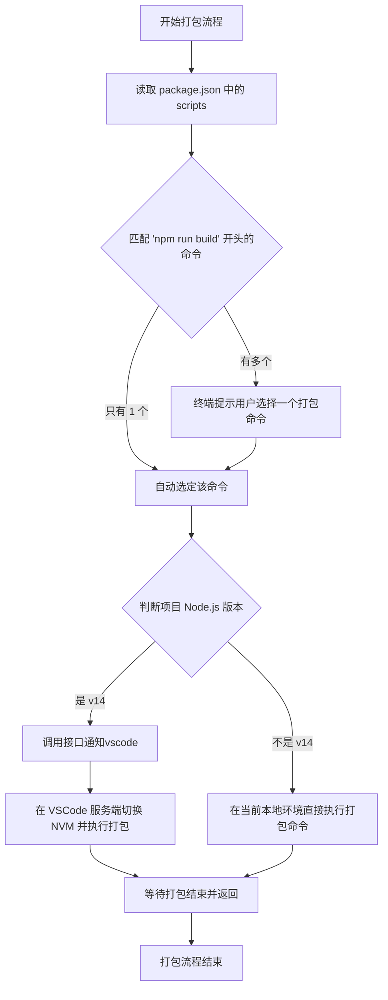
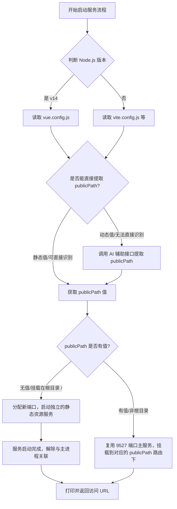

# 功能: 新增 vue 打包与静态资源服务启动功能

**日期**: 2026-03-23
**状态**: 计划中
**相关命令**: `vue` 命令
**业务代码位置**: `packages/cli/src/business/vue`

## 背景 / Context

目前用户需要快速打包不同版本的 Vue 项目，并在打包完成后启动静态资源服务。Vue 项目存在 Node.js 版本差异：旧版（存在 `vue.config.js`）需要 Node.js v14 环境，而新版支持 Node.js v20。
由于命令行默认在 Node.js v20 下运行，当遇到旧版 Vue 项目时需要自动通过 `nvm` 切换环境。
此外，用户还需要能够直接在 VSCode 中右键点击 `dist` 目录，通过调用服务端接口直接启动该静态资源服务。

## 需求

-   **CLI 命令交互**:
    -   无参数执行 `mycli vue` 时，调用系统弹窗（`dialog.ts`）选择项目目录。
    -   支持 `--select` 参数，展示已打开过的历史项目列表供用户选择。
    -   支持 `--skip` 参数，跳过打包阶段，直接启动静态资源服务器。
-   **项目记录**:
    -   选中的项目需保存到本地数据库 `app.json` 的 `vue` 数组中（防重），数据类型参照 `types.ts`。
-   **智能打包流程**:
    -   若未指定 `--skip`，需自动读取 `package.json` 寻找 `npm run build` 开头的脚本。如果有多个则提供列表供用户选择，如果只有一个则自动执行。
    -   判断项目所需 Node.js 版本：若为 v14（如旧版项目），则调用接口 `http://localhost:7001/nvm-switch` 通知 VSCode 服务端切换 nvm 并执行打包，等待结束后切换回 nodejs v20，最后返回；否则在当前本地环境直接执行打包。
-   **静态服务启动策略**:
    -   根据项目所需 Node.js 版本判断要读取的配置文件：若为 v14，读取 `vue.config.js`；否则优先读取 `vite.config.js` 等现代配置。从中提取 `publicPath`。
    -   若提取困难（如值为动态计算），则调用 AI 接口（`useAI`）辅助分析提取。
    -   若 `publicPath` 缺失或为根目录 `/`，则分配新端口启动独立的静态服务。分配新端口启动服务时，需要在服务启动完成后解除与主进程的关联（如 `child.unref(); child.disconnect();`），确保主进程退出不影响该静态服务。
    -   若 `publicPath` 存在且非根目录，则复用端口 `9527` 的主服务，将静态资源挂载到对应的 `publicPath` 路由下。
-   **服务端与 VSCode 扩展接口**:
    -   VSCode 扩展调用的 `/api/vue/start` 接口，其回调逻辑与上述 `mycli vue` 命令的启动逻辑共享 `packages/cli/src/business/vue` 中的核心代码。

## 最终实现方案

-   **主流程与入口 (`packages/cli/src/business/vue/index.ts`** **等)**:
    -   根据命令行参数决定目录获取方式：无参数调用 `showOpenDialog('directory')`；带 `--select` 从 `sql.ts` 读历史记录提示选择。
    -   获取目录后，更新 `app.json` 中的 `vue` 数组（根据路径去重）。
-   **打包控制**:
    -   读取目录下的 `package.json`，匹配 scripts 中 `npm run build` 相关命令，根据数量决定直接执行或 prompt 询问用户。
    -   执行打包前判断 Node 环境需求，如需 v14，向 `http://localhost:7001/nvm-switch` 发起请求由服务端完成打包过程；否则使用本地环境打包。
-   **配置解析与服务挂载**:
    -   根据 Node.js 版本读取相应的配置文件（v14 读 `vue.config.js`），尝试正则提取 `publicPath`。如遇动态复杂值，读取文件文本，调用 `useAI` 传入提示词提取真实的 `publicPath`。
    -   判断 `publicPath`：
        -   **根目录/无值**：寻找可用端口，使用 `express.static` 启动全新静态服务器，并在启动完成后调用 `child.unref()` 和 `child.disconnect()` 解除与主进程关联。
        -   **非根目录**：将目录挂载到已启动的 `9527` 端口服务对应路由下。

## 流程图

### 1. 主流程 (Main Flow)

### 2. 打包流程 (Build Process Flow)

### 3. 启动静态服务流程 (Static Server Start Flow)

## 修改点一览（设计层面）

-   **入口层**：
    -   `packages/cli/src/cli.ts`: 为 `vue` 命令新增 `--start` 参数。
-   **业务逻辑层**：
    -   `packages/cli/src/business/vue/service.ts`: 新增判断 `vue.config.js` 和切换 `nvm` 的逻辑，处理 `--start` 对应的行为。
    -   `packages/server/src/controllers/vue.ts`: 引入 `Router`，新增 `/start` 路由，并实现静态服务启动逻辑（分配端口、返回 URL 等）。
    -   `packages/server/src/index.ts`: 挂载 `vue.ts` 暴露的 Router 到 `/api/vue`。
    -   `packages/vscode-extension/src/index.ts`: 修改 `fetch` 的 URL。

## 代码分析

-   现有的 `vue` 命令已经具备 `buildProject` 和 `startServer` 能力，但 `buildProject` 内部当前可能没有根据文件检测 Node 版本的逻辑。
-   VSCode 扩展中已包含资源管理器右键点击 `dist` 目录的触发器，只需修改 URL 即可。
-   `packages/server/src/index.ts` 现有的 `mountVueProjects` 是在服务启动时加载本地数据库记录，新增的 `/api/vue/start` 则为实时启动接口。
