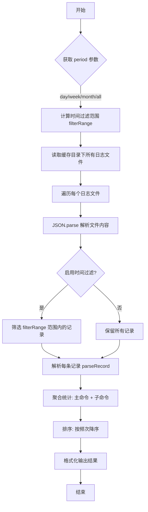

# analyse cli 产品说明书

## 1. 核心价值 (Value Proposition)

量化和可视化 CLI 工具本身的使用情况。通过分析本地日志，帮助开发者和工具维护者了解各命令（及子命令）的真实使用频率和用户习惯，从而为后续功能的迭代、优化或废弃提供数据支撑。

## 2. 用户故事 (User Stories)

- 作为 **CLI 工具的维护者**，我希望**统计不同命令的使用总频次**，以便于**找出最核心、最受欢迎的功能进行重点维护和性能优化**。
- 作为 **CLI 工具的维护者**，我希望**分析特定时间段（如本周、本月）的命令使用情况**，以便于**评估新命令发布后的活跃度和接受度**。
- 作为 **CLI 工具的用户**，我希望**回顾我个人的命令使用历史**，以便于**发现我最常用的高频操作，考虑是否需要为它们设置快捷键 (alias)**。

## 3. 功能特性 (Features)

- [x] **日志解析**：解析本地 `/Users/linzhibin/Documents/coding/cli-tools/cache` 目录下的日志文件。
- [x] **时间过滤**：支持多维度的时间周期过滤（今日 `day`、本周 `week`、本月 `month`、全部 `all`）。
- [x] **智能聚合**：自动识别并聚合主命令（如 `git`, `npm`）及其对应子命令的调用数据。
- [x] **排序展示**：按使用频率从高到低进行排序展示。
- [x] **层级视图**：清晰展示命令与子命令的层级关系及各自的具体使用次数。

## 4. 命令行参数 (Command Arguments)

该命令接受以下选项参数来控制分析行为：

| 参数名        | 简写   | 类型       | 必填 | 默认值   | 描述                                           |
| :--------- | :--- | :------- | :- | :---- | :------------------------------------------- |
| `--period` | `-p` | `string` | 否  | `all` | 指定统计的时间周期。可选值：`day`, `week`, `month`, `all`。 |

**参数逻辑说明**：

- `day`: 统计今日 00:00:00 以来的数据（若无数据则向前回溯一个月）。
- `week`: 统计本周一 00:00:00 以来的数据（若无数据则向前回溯一个月）。
- `month`: 统计本月 1 号 00:00:00 以来的数据。
- `all`: 统计所有历史数据。

## 5. 交互设计 (User Experience)

**输入示例**：

```bash
$ mycli analyse cli --period week
```

**预期输出样式**：

```text
本周从 2023-10-23 09:00:00 至现在，cli共使用 265 次。各命令使用情况如下：

git命令，使用过150次
  ├── pull，使用过80次
  ├── push，使用过50次
  └── commit，使用过20次
npm命令，使用过85次
  ├── install，使用过60次
  └── run，使用过25次
analyse命令，使用过30次
  ├── code，使用过20次
  └── cli，使用过10次
```

## 6. 技术实现 (Technical Implementation)

### 6.1 处理流程图



### 6.2 核心逻辑说明

1. **数据源**：
   - 依赖 `/Users/linzhibin/Documents/coding/cli-tools/cache` 目录下的日志文件。
   - 文件命名通常包含时间戳，按文件名排序读取。
2. **命令解析规则 (`parseRecord`)**：
   - 使用正则 `^([a-z]+)\s*([a-z]*)` 提取命令。
   - **特殊处理**：对于 `git`, `npm`, `ai` 等复合命令，会额外识别第二个单词作为子命令（subCmd）。
   - **兜底**：如果无法识别标准格式，则记录原始消息。
3. **聚合策略**：
   - 采用 `Map` 或对象数组结构，以主命令（cmd）为 Key 进行聚合。
   - 每个主命令下维护一个 `children` 数组，存储子命令的统计。

## 7. 约束与限制 (Constraints)

- **性能要求**：日志文件可能随时间变得非常庞大，解析和统计过程需保持在毫秒级，避免内存溢出（可考虑流式读取大文件）。
- **容错处理**：需要能优雅处理损坏的日志行或无法解析的时间戳，不能因为单行错误导致整个分析崩溃。
- **数据时效性**：在 `day` 和 `week` 模式下，为了提升查询效率，会限制回溯时间不超过一个月。

