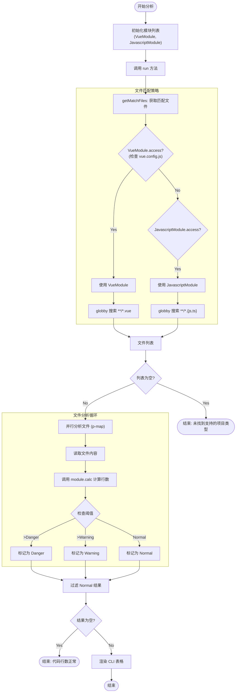

# Code Analysis

## 1. 核心价值 (Value Proposition)

-   **代码质量控制**：通过监控文件行数，帮助团队发现可能需要重构的超大文件，避免“上帝类”或“巨型组件”的出现。
-   **针对性分析**：特别针对 Vue 项目和普通 JS/TS 项目提供不同的分析策略，Vue 项目还能深入分析 template、script、style 的行数分布。
-   **直观反馈**：通过颜色高亮（警告/危险）和清晰的表格展示，让开发者一眼识别问题文件。

## 2. 用户故事 (User Stories)

-   **作为一名开发者**，我希望在提交代码前检查是否有文件行数过长，以便及时拆分和优化代码结构。
-   **作为一名 Tech Lead**，我希望在 CI/CD 流程中加入代码行数检查，以防止低质量代码合入主分支。
-   **作为一名 Vue 开发者**，我希望知道组件中 template 和 script 的具体行数，以便判断是否需要提取子组件或 hook。

## 3. 功能特性 (Features)

-   **多模块支持**：
    -   **Vue 模块**：自动检测 `vue.config.js`，分析 `.vue` 文件，提供 template/script/style 详细行数分布。
    -   **JavaScript 模块**：作为通用后备，分析 `.js` 和 `.ts` 文件。
-   **智能阈值**：
    -   Vue 文件：>500 行警告，>700 行危险。
    -   JS/TS 文件：>300 行警告，>500 行危险。
-   **可视化报告**：使用 `cli-table3` 生成表格，根据危险级别使用不同颜色（Yellow/Red）标识。
-   **自动过滤**：自动忽略 `node_modules` 和 `dist` 目录。

## 4. 交互设计 (User Experience)

### 命令行输出

运行命令后，CLI 会显示加载动画，分析完成后输出如下表格：

```text
警告行数：300行，危险行数：500行
┌───┬──────────────────────────┬──────┐
│   │ 文件地址                 │ 行数 │
├───┼──────────────────────────┼──────┤
│ 1 │ src/utils/helper.ts      │ 320  │
├───┼──────────────────────────┼──────┤
│ 2 │ src/core/heavy-logic.js  │ 600  │
└───┴──────────────────────────┴──────┘
```

对于 Vue 项目：

```text
警告行数：500行，危险行数：700行
┌───┬──────────────────────────┬──────┬──────────────────────────────────────────┐
│   │ 文件地址                 │ 行数 │ 代码分布                                 │
├───┼──────────────────────────┼──────┼──────────────────────────────────────────┤
│ 1 │ src/views/BigView.vue    │ 800  │ template:300行;script:450行;style:50行   │
└───┴──────────────────────────┴──────┴──────────────────────────────────────────┘
```

## 5. 技术实现 (Technical Implementation)

### 模块设计

采用策略模式设计，定义了统一的 `Module` 接口，不同类型的文件分析逻辑实现该接口。

-   **Module 接口**：定义了 `access`（是否启用）、`filePattern`（文件匹配模式）、`calc`（行数计算）、`render`（表格渲染配置）等方法。
-   **VueModule**：专门处理 Vue 单文件组件，包含复杂的 template/script/style 提取逻辑。
-   **JavascriptModule**：处理普通 JS/TS 文件。

### 核心流程



## 6. 约束与限制 (Constraints)

-   **互斥分析**：目前仅支持单一模式分析。如果检测到 Vue 项目（存在 `vue.config.js`），则只分析 `.vue` 文件，会忽略项目中的 `.js` 或 `.ts` 文件。
-   **硬编码阈值**：目前的警告和危险阈值是在代码中硬编码的，暂不支持通过配置文件自定义。
-   **文件编码**：默认按 UTF-8 读取文件，不支持其他编码。
-   **Vue 分析限制**：Vue 文件的 template/script/style 分析依赖简单的字符串匹配和正则，对于极其复杂的嵌套或非标准写法可能存在误差。
-   **项目识别**：Vue 项目识别仅依赖 `vue.config.js`，对于使用 Vite (`vite.config.ts`) 或其他构建工具的 Vue 项目可能无法正确识别（会降级为 JS 模式，只分析 `.js/.ts` 文件而忽略 `.vue` 文件）。
