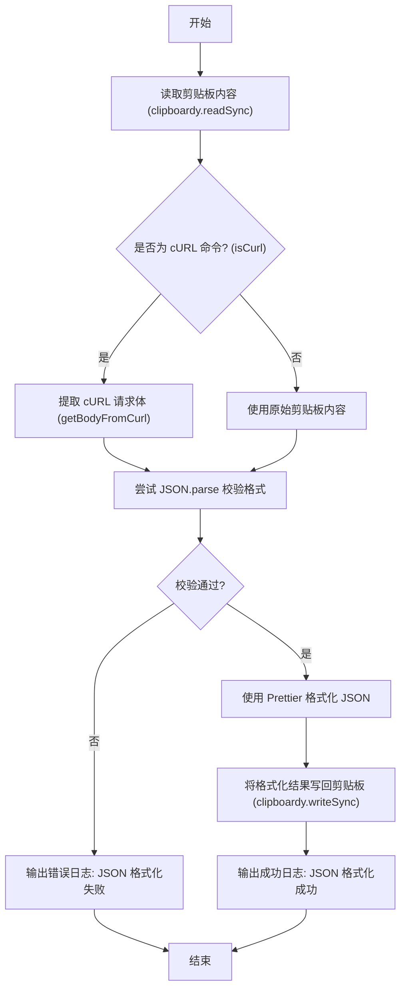

# beauty 产品说明书

## 1. 核心价值 (Value Proposition)

提升开发者处理 JSON 数据的效率。通过一键读取系统剪贴板内容，自动识别纯 JSON 字符串或 cURL 命令中包含的 JSON 请求体，并将其格式化（美化）后重新写入剪贴板，免去手动打开格式化工具、粘贴、复制的繁琐步骤。

## 2. 用户故事 (User Stories)

- 作为 **开发者**，我希望**能一键格式化剪贴板里压缩/混乱的 JSON 字符串**，以便于**直接粘贴到编辑器或文档中进行阅读和分析**。
- 作为 **后端/前端开发**，我希望**在复制了浏览器网络面板中的 cURL 请求后，能快速提取并美化其中的 JSON 请求体**，以便于**快速调试接口或查看请求参数**。

## 3. 功能特性 (Features)

- [x] **剪贴板读写**：直接读取系统剪贴板内容，并将处理结果无缝写回。
- [x] **cURL 智能解析**：自动检测剪贴板内容是否为 cURL 命令，如果是，则精准提取其中的请求体 (Body) 数据。
- [x] **JSON 校验与美化**：内置 JSON 格式校验，使用 Prettier 引擎进行标准化、高质量的代码格式化。
- [x] **状态反馈**：通过终端日志清晰地告知用户格式化成功或失败的结果。

## 4. 命令行参数 (Command Arguments)

该命令作为一个快捷操作，目前不需要任何选项参数，直接运行即可。

| 参数名 | 简写 | 类型 | 必填 | 默认值 | 描述 |
| :--- | :--- | :--- | :--- | :--- | :--- |
| 无 | 无 | - | - | - | 直接执行剪贴板格式化操作 |

## 5. 交互设计 (User Experience)

**输入示例**：

```bash
$ mycli beauty
```

**预期输出样式**：

*成功情况*：
```text
✔ JSON 格式化成功
```
*(此时剪贴板内容已被替换为格式化后的 JSON)*

*失败情况*（剪贴板内容不是合法的 JSON 或包含无法解析的内容）：
```text
✖ JSON 格式化失败
```

## 6. 技术实现 (Technical Implementation)

### 6.1 处理流程图



### 6.2 核心逻辑说明

1. **剪贴板交互**：依赖 `clipboardy` 库实现跨平台的剪贴板读写操作。
2. **cURL 解析拦截**：在进行 JSON 解析前，引入 `isCurl` 和 `getBodyFromCurl` 拦截器，增强了对网络调试场景（如从 Chrome DevTools 复制 cURL）的兼容性。
3. **格式化引擎**：采用前端生态标准的 `prettier` 库，并指定 `parser: 'json'` 以确保格式化输出的规范性和一致性。
4. **异常处理**：在调用 Prettier 之前使用 `JSON.parse` 进行前置校验，以捕获并优雅处理非 JSON 文本导致的异常，避免程序崩溃。

## 7. 约束与限制 (Constraints)

- **数据类型限制**：目前硬编码仅支持 JSON 格式的解析与美化，暂不支持 XML、YAML 等其他数据格式。
- **系统依赖**：强依赖操作系统的剪贴板功能，在某些无头环境 (Headless) 或受限的 CI/CD 环境中可能无法正常工作。
