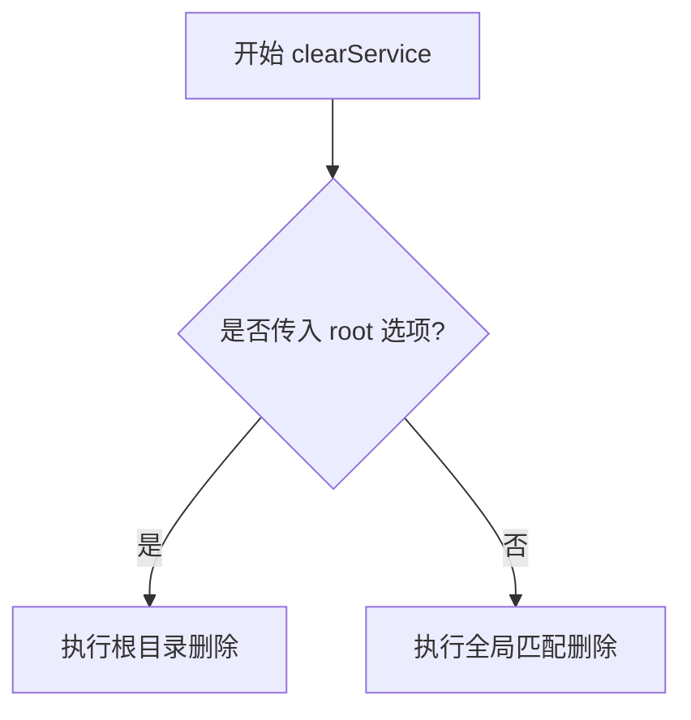
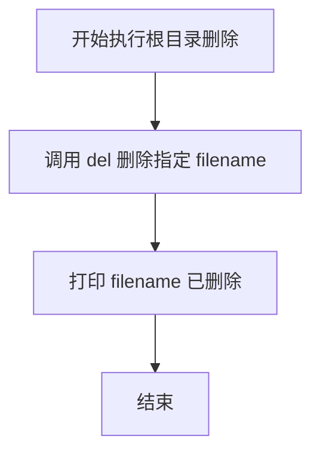
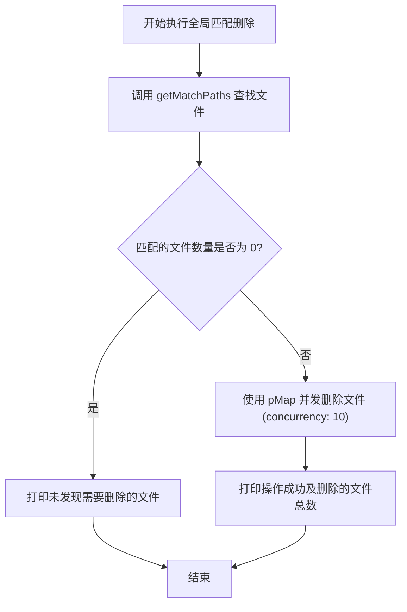

# clear cli 产品说明书

## 1. 核心价值 (Value Proposition)

提供一个高效、便捷的文件清理工具，专门用于清理项目中冗余或不需要的文件。特别针对跨平台协作时常见的问题（如 Windows 上通过 Git 同步过来的 macOS `.DS_Store` 文件），能够快速进行全局扫描和并发删除，保持项目工作区的整洁。

## 2. 用户故事 (User Stories)

- 作为 **Windows 开发者**，我希望**能一键删除项目中所有的 `.DS_Store` 文件**，以便于**保持工作区干净，避免这些系统生成文件带来的干扰**。
- 作为 **项目维护者**，我希望**只删除当前根目录下的特定临时文件**，以便于**不影响子目录中的同名文件**。
- 作为 **CLI 工具的用户**，我希望**文件清理过程能尽可能快**，以便于**在大型项目中也能迅速完成无用文件的回收，节省时间**。

## 3. 功能特性 (Features)

- [x] **全局匹配**：递归查找并匹配项目中的指定文件，自动忽略 `node_modules` 目录以提升性能。
- [x] **根目录模式**：支持仅删除根目录下的指定文件，不进行深度遍历。
- [x] **并发删除**：使用并发控制技术（最大并发数为 10）批量删除文件，显著提升清理效率。
- [x] **结果反馈**：清理完成后，清晰地告知用户成功删除了多少个文件或未找到相关文件。

## 4. 命令行参数 (Command Arguments)

该命令接受以下参数和选项来控制清理行为：

| 参数/选项名 | 类型 | 必填 | 默认值 | 描述 |
| :--- | :--- | :--- | :--- | :--- |
| `filename` | `string` | 是 | 无 | 需要清理的目标文件名（如 `.DS_Store`）。 |
| `--root` | `boolean` | 否 | `false` | 是否仅删除根目录下的目标文件。 |

**参数逻辑说明**：

- `filename`: 指定要删除的具体文件名。如果是全局模式，会在所有非 `node_modules` 的子目录中查找该文件。
- `--root`: 如果启用此选项，将不会进行全局搜索，而是直接尝试删除当前工作目录下对应的 `filename`。

## 5. 交互设计 (User Experience)

**输入示例 1 (全局清理)**：

```bash
$ mycli clear .DS_Store
```

**预期输出样式 1**：

```text
操作成功，共删除15个文件
```

**输入示例 2 (未找到文件)**：

```bash
$ mycli clear .DS_Store
```

**预期输出样式 2**：

```text
未发现需要删除的文件
```

**输入示例 3 (仅根目录清理)**：

```bash
$ mycli clear temp.log --root
```

**预期输出样式 3**：

```text
temp.log已删除
```

## 6. 技术实现 (Technical Implementation)

### 6.1 总入口分流图 (Main Dispatch Flow)



### 6.2 根目录删除流程 (Root Deletion Flow)



### 6.3 全局匹配删除流程 (Recursive Match Deletion Flow)



### 6.4 核心逻辑说明

1. **文件查找 (`getMatchPaths`)**：
   - 使用 `globby` 库进行文件匹配查找。
   - 匹配规则为 `**/*/${filename}`，同时显式排除 `!node_modules` 目录，避免无意义的深度遍历和误删。
2. **并发控制**：
   - 在全局匹配删除模式下，为了提高多文件删除的效率，引入了 `p-map` 进行并发处理。
   - 并发数 (`concurrency`) 设置为 `10`，以防止在大量文件删除时占用过高的系统 I/O 资源或触发文件描述符限制。

## 7. 约束与限制 (Constraints)

- **忽略目录**：全局搜索默认会硬编码忽略 `node_modules` 目录，目前不支持自定义忽略规则。
- **并发上限**：并发删除的数量被限制在 10 个以内，以保证运行时的系统稳定性。