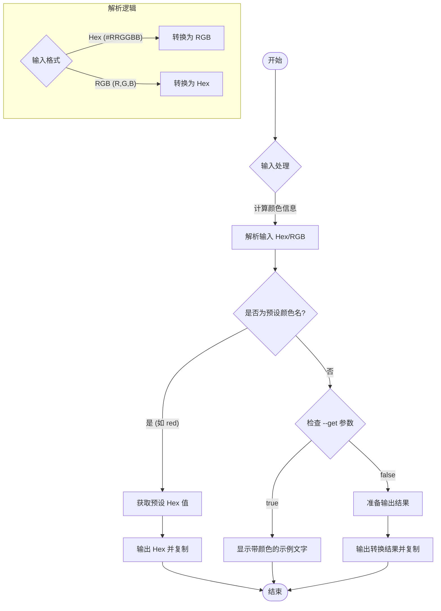

# 颜色转换工具 (Color Converter)

这是一个简单而强大的命令行颜色转换工具，支持 Hex 和 RGB 格式的互转，以及常用颜色名称的快速查询。它旨在帮助开发者和设计师快速获取所需的颜色代码，并提供终端内的颜色预览功能。

## 核心价值

*   **双向转换**：支持 Hex (十六进制) 与 RGB 格式之间的自动识别和互转。
*   **常用预设**：内置常用颜色名称（如 red, blue, cyan 等）的 Hex 值查询。
*   **即时可用**：转换结果自动复制到剪贴板，无需手动选择复制。
*   **视觉反馈**：在终端中直接展示颜色预览，确保所见即所得。

## 用户故事

*   **作为前端开发者**，我经常需要将设计稿中的 Hex 颜色转换为 RGB 格式以便在 CSS 中使用 `rgba()`，我希望有一个工具能一键完成转换并复制结果。
*   **作为 UI 设计师**，有时我手头只有 RGB 数值，需要转换为 Hex 代码发给开发人员，我希望能快速完成这个操作。
*   **作为一名 CLI 用户**，我希望能通过输入简单的颜色名称（如 `red`）直接获取其标准的 Hex 代码，而不需要去搜索。
*   **作为视觉敏感的用户**，在转换颜色的同时，我希望能看到该颜色的实际显示效果，以确认它是我想要的颜色。

## 功能特性

-   **Hex 转 RGB**：输入 `#ff0000` 或 `ff0000`，输出 `255, 0, 0`。
-   **RGB 转 Hex**：输入 `255,0,0` 或 `255, 0, 0`，输出 `#ff0000`。
-   **预设颜色查询**：支持查询 `red`, `blue`, `green`, `yellow`, `orange`, `purple` 等常见颜色。
-   **自动复制**：转换成功后，结果会自动写入系统剪贴板。
-   **颜色预览**：通过 `--get` 参数或默认输出中包含颜色预览。

## 交互设计

### 命令行参数

| 参数 | 类型 | 描述 | 示例 |
| :--- | :--- | :--- | :--- |
| `input` | `string` | 输入的颜色值 (Hex, RGB 或 颜色名称) | `#ff0000`, `255,0,0`, `red` |
| `--get` | `boolean` | 仅显示带有该颜色的示例文本，不输出代码 | `color #ff0000 --get` |
| `--help` | `boolean` | 显示帮助信息 | `color --help` |

### 使用示例

1.  **Hex 转 RGB**
    ```bash
    $ color #ff0000
    [已复制] 255, 0, 0
    ```

2.  **RGB 转 Hex**
    ```bash
    $ color 255,0,0
    [已复制] #FF0000
    ```

3.  **查询预设颜色**
    ```bash
    $ color red
    [已复制] #ff0000
    ```

4.  **预览颜色**
    ```bash
    $ color #00ff00 --get
    示例文字 (以绿色显示)
    ```

## 技术实现

该模块主要依赖 `color-convert` 库进行颜色空间的计算，使用 `chalk` 进行终端颜色渲染，并利用 `clipboardy` 实现剪贴板操作。



## 约束与限制

1.  **输入格式容错**：虽然支持一定的格式容错（如 RGB 中的空格），但建议使用标准格式以确保准确性。
2.  **预设颜色范围**：目前仅支持代码中硬编码的颜色映射表（`COLOR_MAP`），不支持所有 CSS 颜色名称。
3.  **环境依赖**：剪贴板功能依赖于系统环境，在某些无头（headless）环境或 SSH 会话中可能无法工作。
