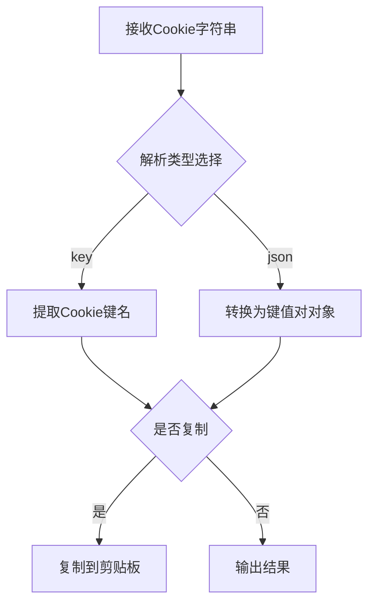

# Cookie 解析模块

## 功能概述

该模块提供 Cookie 字符串解析功能，支持将 Cookie 字符串转换为键名数组或键值对对象，并可选择复制结果到剪贴板。

## 实现计划



## API 设计

### 主要方法：`main(data: string, options: Options)`

-   参数：
    -   `data`：待解析的 Cookie 字符串
    -   `options`：解析配置选项
        -   `type`：解析类型（'key' 或 'json'）
        -   `copy`：是否复制结果到剪贴板
        -   `help`：是否显示帮助信息（可选）

### 返回值

-   控制台输出解析结果
-   可选：复制结果到剪贴板

## 使用示例

```typescript
// 解析 Cookie 为 JSON
const cookieParser = new CookieCommand();
cookieParser.main('key1=value1; key2=value2', { type: 'json', copy: true });

// 仅获取 Cookie 键名
cookieParser.main('key1=value1; key2=value2', { type: 'key', copy: false });
```

## 注意事项

-   输入的 Cookie 字符串应符合标准 `key=value` 格式
-   解析结果默认输出到控制台
-   复制到剪贴板为可选操作
