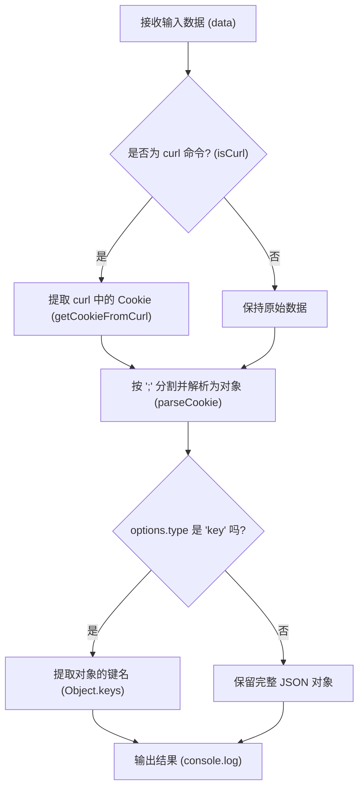

# Cookie 解析模块 产品说明书

## 1. 核心价值 (Value Proposition)

提供一个快捷的命令行工具，用于解析和转换 HTTP 格式的 Cookie 字符串。通过将繁杂的 Cookie 字符串转化为易读的 JSON 格式或提取全部键名，帮助开发者在接口调试、爬虫开发或网络请求排查时，极大提升分析 Cookie 数据的效率。

## 2. 用户故事 (User Stories)

- 作为 **前端开发者或测试工程师**，我希望**能将浏览器中复制的长串 Cookie 快速转换为 JSON 对象**，以便于**在代码中直接作为 Mock 数据使用或在 Postman 等工具中查阅**。
- 作为 **后端开发者**，我希望**能直接输入一段带有 Cookie 的 curl 命令**，工具能自动提取并解析其中的 Cookie，以便于**我能快速复现和调试请求携带的身份信息**。
- 作为 **安全研发人员**，我希望**能快速提取出 Cookie 字符串中的所有键名 (keys)**，以便于**排查是否缺失了某些关键的鉴权字段 (如 session_id, token)**。

## 3. 功能特性 (Features)

- [x] **多格式解析**：支持将标准 Cookie 字符串转换为直观的 JSON 键值对对象。
- [x] **键名提取**：支持仅提取 Cookie 中的所有键名，方便快速审查字段。
- [x] **Curl 智能识别**：自动识别输入的字符串是否为 curl 命令，并从中精准提取 Cookie 信息进行解析。
- [x] **灵活的输入方式**：支持直接通过命令行参数传入字符串，或从剪贴板读取内容。

## 4. 命令行参数 (Command Arguments)

该命令接受以下选项参数来控制分析行为：

| 参数名 | 简写 | 类型 | 必填 | 默认值 | 描述 |
| :--- | :--- | :--- | :--- | :--- | :--- |
| `cookieValue` | - | `string` | 否 | - | 需要解析的 Cookie 字符串或包含 Cookie 的 curl 命令。支持从剪贴板读取。 |
| `--type` | - | `string` | 否 | `json` | 指定输出格式。可选值：`json` (输出键值对对象) 或 `key` (仅输出键名数组)。 |
| `--copy` | - | `boolean` | 否 | `false` | 将解析结果复制到剪贴板。 |

## 5. 交互设计 (User Experience)

**输入示例 1：解析为 JSON**

```bash
$ mycli cookie "a=b;c=d" --type=json
```

**预期输出：**

```json
{
    "a": "b",
    "c": "d"
}
```

**输入示例 2：仅提取键名**

```bash
$ mycli cookie "a=b;c=d" --type=key
```

**预期输出：**

```json
[
    "a",
    "c"
]
```

## 6. 技术实现 (Technical Implementation)

### 6.1 处理流程图

根据 `service.ts` 的逻辑，该命令为一个线性的解析流程，包含对 curl 命令的条件判断。



### 6.2 核心逻辑说明

1. **输入预处理**：判断传入的数据是否为完整的 curl 请求命令，如果是，则调用 `getCookieFromCurl` 提取出真正的 Cookie 字符串。
2. **Cookie 解析 (`parseCookie`)**：
   - 使用分号 `;` 分割字符串得到键值对列表。
   - 遍历列表，使用等号 `=` 分割每个键值对，去除首尾空格。
   - 对无值的键进行兼容处理（无等号设为 `undefined`，有等号无值设为 `""`）。
3. **输出格式化**：根据 `options.type` 的值，决定是输出完整的解析对象，还是仅仅输出所有的 `key` 组成的数组。
4. **反向序列化 (`stringifyCookie`)**：提供将对象转换回 Cookie 字符串的方法，处理 `undefined` 等特殊情况。

## 7. 约束与限制 (Constraints)

- **Cookie 格式标准**：输入的 Cookie 字符串需尽量符合标准的 `key=value;` 格式。若存在不规范的分号或等号使用，可能导致解析出现偏差。
- **Curl 提取准确性**：基于匹配的 `getCookieFromCurl` 可能无法覆盖所有极度复杂的 curl 命令变形（如跨多行的复杂转义）。
