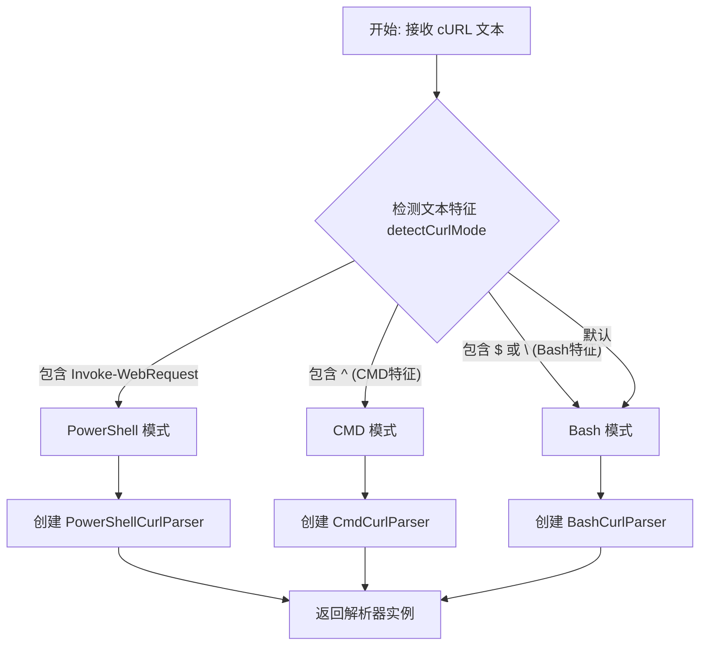
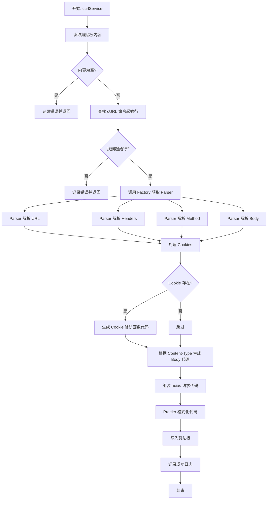

# Curl Converter 产品说明书

## 1. 核心价值 (Value Proposition)

**将复杂的 cURL 命令一键转换为现代化的 Node.js 代码。**

在开发和调试过程中，开发者经常需要将浏览器控制台（Network 面板）或 API 文档中的 cURL 命令转换为可执行的代码。手动转换不仅繁琐，而且容易出错（特别是处理 Headers、Cookies 和转义字符时）。本工具通过自动检测 cURL 格式（Bash/CMD/PowerShell），精准解析请求参数，并生成格式化好的 `axios` 调用代码，极大地提升了开发效率。

## 2. 用户故事 (User Stories)

-   作为 **后端开发者**，我希望**直接复制浏览器中的网络请求（Copy as cURL）**，并将其**转换为 Node.js 脚本**，以便于**快速复现 Bug 或测试接口**。
-   作为 **爬虫工程师**，我希望**自动提取 cURL 中的 Cookie 和 Headers**，以便于**在脚本中模拟用户登录态**。
-   作为 **Windows 用户**，我希望**工具能识别 PowerShell 格式的 `Invoke-WebRequest`**，因为**我的系统默认使用 PowerShell，而大多数工具只支持 Bash 格式**。
-   作为 **API 使用者**，我希望**生成的代码自动包含 `axios` 和 `form-data` 依赖**，以便于**我直接粘贴到项目中运行**。

## 3. 功能特性 (Features)

-   [x] **智能模式检测**：自动识别 Bash (`curl`)、CMD (`curl ^`) 和 PowerShell (`Invoke-WebRequest`) 格式。
-   [x] **全字段解析**：支持解析 URL、Method、Headers、Cookies 和 Body 数据。
-   [x] **Cookie 增强**：自动提取 Cookie 并生成辅助函数 `stringifyCookie`，方便管理和复用。
-   [x] **多格式 Body 支持**：支持 `application/json` 和 `application/x-www-form-urlencoded`（自动处理 `FormData`）。
-   [x] **代码格式化**：生成的代码经过 Prettier 自动格式化，整洁易读。
-   [x] **剪贴板交互**：自动读取剪贴板内容，处理后将生成的代码写回剪贴板。

## 4. 命令行参数 (Command Arguments)

该命令接受以下选项参数来控制解析行为：

| 参数名   | 类型      | 必填 | 默认值 | 描述                     |
| :------- | :-------- | :--- | :----- | :----------------------- |
| `extra`  | `string`  | 否   | -      | 需要显示的其他 headers 字段 |
| `full`   | `boolean` | 否   | `false`| 是否显示全部 headers 字段   |

## 5. 交互设计 (User Experience)

**使用流程**：

1.  在浏览器 Network 面板右键点击请求 -> Copy -> Copy as cURL (bash/cmd/powershell)。
2.  在终端运行命令：

```bash
$ mycli curl
```

3.  工具提示 `生成成功`。
4.  在代码编辑器中 `Ctrl+V` 粘贴生成的代码。

**生成的代码示例**：

```javascript
import axios from 'axios';

/**
 * 将对象转换为 cookie 字符串
 */
const stringifyCookie = (obj) => {
    // ... helper implementation
};

const cookieObj = {
    "session_id": "xyz123"
};

(async () => {
    try {
        const res = await axios({
            method: 'POST',
            url: 'https://api.example.com/data',
            headers: {
                'Content-Type': 'application/json',
                Cookie: stringifyCookie(cookieObj)
            },
            data: {
                foo: "bar"
            },
        });
        console.log(res.data);
    } catch(e) {
        console.log(e.message);
    }
})()
```

## 6. 技术实现 (Technical Implementation)

### 6.1 工厂分流逻辑 (Factory Dispatch)

根据输入的 cURL 文本特征，自动选择对应的解析器策略。



### 6.2 主处理流程 (Main Process)

核心业务逻辑在 `curlService` 中统一编排。



## 7. 约束与限制 (Constraints)

-   **环境依赖**：运行环境必须支持剪贴板操作（服务器端无头模式下可能无法工作）。
-   **格式兼容性**：虽然支持主流格式，但对于极其冷门或高度定制化的 cURL 写法可能无法完美解析。
-   **依赖库**：生成的代码依赖 `axios`，如果是 `application/x-www-form-urlencoded` 且有 Body 数据，还依赖 `form-data`。用户需确保项目中安装了这些库。
