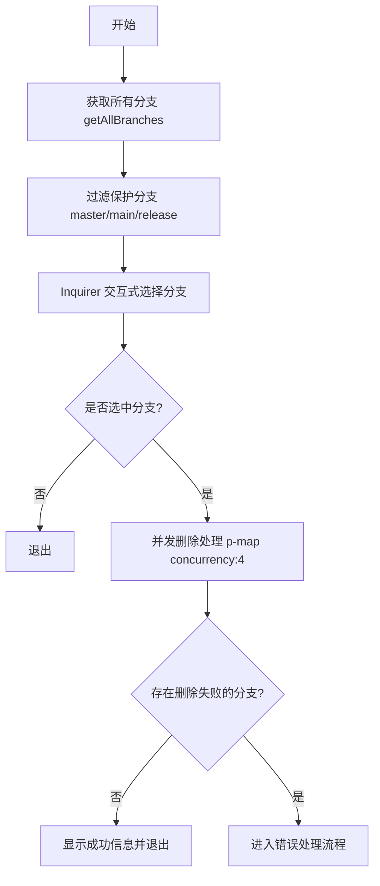
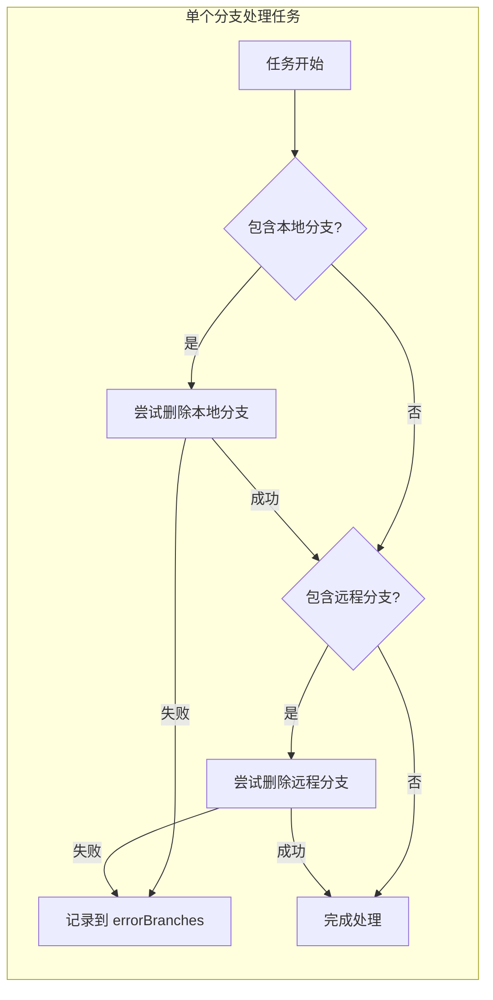
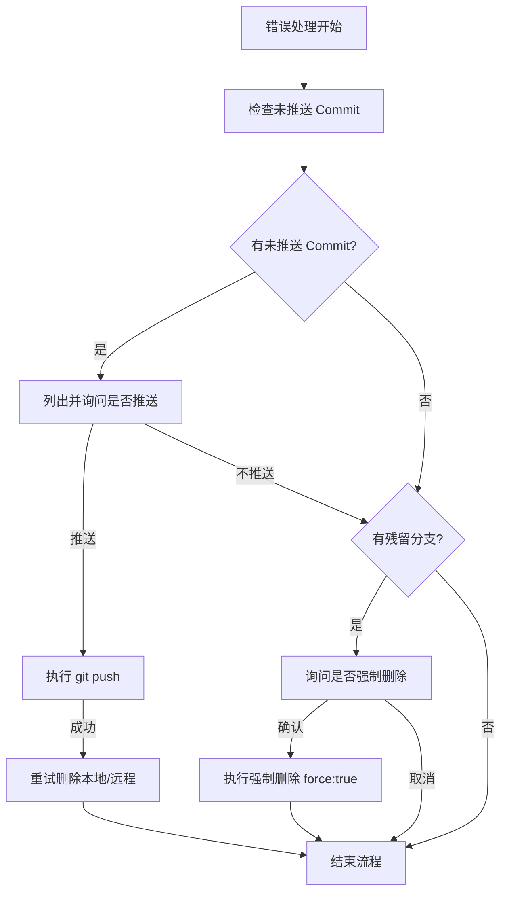

# git branch delete 产品说明书

## 1. 核心价值 (Value Proposition)

提供安全、高效的 Git 分支清理工具。通过可视化的交互界面，帮助开发者快速识别并批量删除不再使用的分支（包括本地和远程），同时内置严格的安全检查机制，防止误删未合并或未推送的代码，保持代码仓库的整洁。

## 2. 用户故事 (User Stories)

- 作为 **开发者**，我希望**批量删除已经合并的特性分支**，以便于**保持本地开发环境的整洁**。
- 作为 **团队成员**，我希望**在删除分支前清楚地知道它是本地分支还是远程分支**，以便于**做出正确的删除决策**。
- 作为 **开发者**，我希望**在删除含有未推送提交的分支时收到警告**，以便于**避免意外丢失未备份的代码**。
- 作为 **开发者**，我希望**自动跳过 master/main 等保护分支**，以便于**防止误操作导致严重后果**。

## 3. 功能特性 (Features)

- [x] **智能过滤**：自动隐藏 `master`, `main`, `release` 等关键保护分支，防止误删。
- [x] **可视化展示**：通过颜色区分分支状态（青色：本地+远程，黄色：仅本地，蓝色：仅远程）。
- [x] **批量操作**：支持通过交互式列表多选分支进行批量删除。
- [x] **并发处理**：采用并发机制（默认并发数 4）加速批量删除过程。
- [x] **双端同步**：支持同时删除本地分支和对应的远程分支。
- [x] **安全兜底**：
    - 删除失败时提供详细反馈。
    - 检测未推送的 Commit，提供“先推送再删除”的补救选项。
    - 支持对顽固分支进行强制删除（Force Delete）。

## 4. 命令行参数 (Command Arguments)

该命令主要通过交互式界面进行操作，不依赖复杂的命令行参数。

## 5. 交互设计 (User Experience)

**选择分支**：

```text
? 请选择要删除的分支 (Press <space> to select, <a> to toggle all, <i> to invert selection)
❯◯ feature/login (local)
 ◯ fix/bug-123 (all)
 ◯ feature/new-ui (remote)
```

**删除确认与反馈**：

```text
✔ 正在删除所选分支
⚠ 以下分支有未推送的 commit：
- feature/login
? 是否推送这些分支的 commit？ (y/N)
```

## 6. 技术实现 (Technical Implementation)

### 6.1 处理流程图

#### 6.1.1 主交互流程



#### 6.1.2 单个分支删除逻辑



#### 6.1.3 错误处理与补救



### 6.2 核心逻辑说明

1.  **分支状态识别**：
    -   利用 `getAllBranches` 工具函数获取分支列表。
    -   根据 `hasLocal` 和 `hasRemote` 属性组合判断分支类型，并应用 `chalk` 进行颜色标记。

2.  **安全删除机制**：
    -   **第一道防线**：在列表生成阶段直接过滤掉硬编码的保护分支（`master`, `main`, `release`）。
    -   **第二道防线**：标准删除操作（非强制），Git 本身会拦截未合并的分支删除请求。
    -   **第三道防线**：当检测到删除失败时，通过 `git log origin/branch..branch` 检查是否存在未推送的 commit，引导用户先推送备份。

3.  **并发控制**：
    -   使用 `p-map` 库限制并发数为 4，避免同时发起过多的 Git 进程导致系统资源紧张或 Git 锁冲突。

## 7. 约束与限制 (Constraints)

-   **交互环境**：必须在支持 TTY 的终端环境中运行，无法在非交互式脚本中直接使用（除非通过模拟输入）。
-   **网络依赖**：删除远程分支或推送代码时需要网络连接，且需配置好 Git 远程仓库权限。
-   **Git 版本**：依赖本地安装的 Git 命令行工具。
