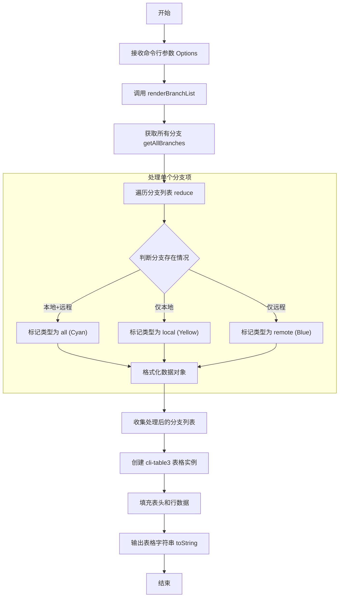

# git branch get 产品说明书

## 1. 核心价值 (Value Proposition)

提供清晰、直观的 Git 分支概览。通过结构化的表格形式，统一展示本地和远程分支的状态及创建时间，帮助开发者快速了解项目分支全貌，识别冗余分支。

## 2. 用户故事 (User Stories)

- 作为 **开发者**，我希望**一目了然地看到所有分支及其同步状态**，以便于**确认本地分支是否已推送到远程**。
- 作为 **开发者**，我希望**查看分支的创建时间**，以便于**识别并清理过期的临时分支**。
- 作为 **开发者**，我希望**通过关键词快速筛选分支**，以便于**在大量分支中定位目标分支**。

## 3. 功能特性 (Features)

- [x] **全量展示**：获取并展示项目中的所有分支（包括本地和远程）。
- [x] **状态区分**：通过颜色直观标识分支类型：
    - `all` (青色)：本地和远程均存在（已同步）。
    - `local` (黄色)：仅本地存在。
    - `remote` (蓝色)：仅远程存在。
- [x] **信息丰富**：展示分支名称、类型以及创建时间。
- [x] **表格布局**：使用 `cli-table3` 生成整齐的 ASCII 表格，提升阅读体验。
- [x] **关键词过滤**：支持通过 `--key` 参数按名称筛选分支（代码已实现逻辑支持）。

## 4. 命令行参数 (Command Arguments)

| 参数名 | 简写 | 类型 | 必填 | 默认值 | 描述 |
| :--- | :--- | :--- | :--- | :--- | :--- |
| `--key` | - | `string` | 否 | - | 分支名称关键词过滤。 |
| `--delete` | `-d` | `boolean` | 否 | `false` | 切换到删除模式（见 `git branch delete`）。 |

## 5. 交互设计 (User Experience)

**执行命令**：

```bash
$ mycli git branch
```

**输出示例**：

```text
┌─────────────────┬──────────┬─────────────────────┐
│ 名称            │ 类型     │ 创建时间            │
├─────────────────┼──────────┼─────────────────────┤
│ feature/login   │ local    │ 2023-10-25 10:00:00 │
│ master          │ all      │ 2023-01-01 00:00:00 │
│ origin/old-feat │ remote   │ 2023-09-15 14:30:00 │
└─────────────────┴──────────┴─────────────────────┘
```
*(注：实际输出中类型字段带有颜色高亮)*

## 6. 技术实现 (Technical Implementation)

### 6.1 处理流程图



### 6.2 核心逻辑说明

1.  **数据获取**：
    -   调用 `getAllBranches` 获取原始分支数据，该函数封装了底层的 git 命令调用。
2.  **数据清洗与格式化**：
    -   遍历原始数据，根据 `hasLocal` 和 `hasRemote` 字段判断分支的归属类型。
    -   应用 `chalk` 库为不同类型的分支添加颜色代码，增强可读性。
    -   保留 `createTime` 字段用于展示。
3.  **视图渲染**：
    -   使用 `cli-table3` 构建表格，配置表头 `['名称', '类型', '创建时间']`。
    -   将格式化后的数据行推入表格并输出。

## 7. 约束与限制 (Constraints)

-   **终端宽度**：如果分支名称过长或终端窗口过窄，表格可能会发生换行，影响美观。
-   **性能**：当仓库分支数量极大（如数千个）时，`getAllBranches` 的执行和表格渲染可能会有轻微延迟。
-   **时间格式**：创建时间的显示依赖于底层 git 命令获取的时间格式。
