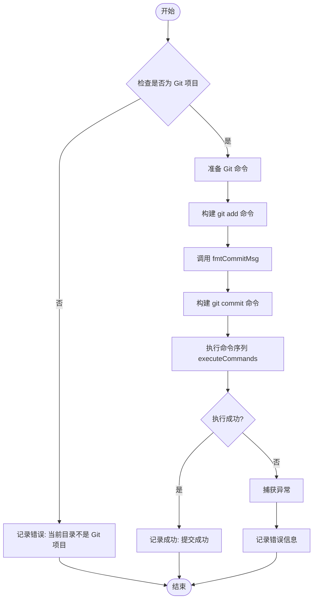
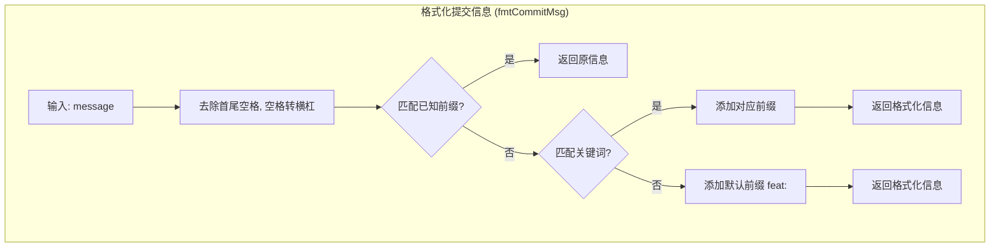

# Git Commit Product Documentation

## 核心价值 (Value Proposition)

`git commit` 命令旨在简化和规范化代码提交过程。它通过自动格式化提交信息（Commit Message），确保团队协作中提交记录的一致性和可读性，同时减少了开发者手动输入标准前缀的繁琐工作。

## 用户故事 (User Stories)

-   **作为一名开发者**，我希望只需输入简短的提交描述，工具能自动为我添加正确的类型前缀（如 `feat:`, `fix:`），以便我能专注于描述变更内容。
-   **作为一名团队负责人**，我希望团队成员的提交记录遵循统一的规范（如 Conventional Commits），以便于生成变更日志和版本管理。
-   **作为一名新入职员工**，我希望工具能提示或自动纠正我的提交格式，以便我能快速融入团队的开发规范。

## 功能特性 (Features)

1.  **智能提交信息格式化**：
    -   自动检测提交信息中的关键词（如“修复”、“新增”）。
    -   根据关键词自动添加符合规范的前缀（如 `fix:`, `feat:`, `docs:` 等）。
    -   支持多种常见类型的自动识别（feat, fix, docs, style, perf, test, build, ci, chore, refactor）。
    -   如果未匹配到任何关键词，默认使用 `feat:` 前缀。
2.  **灵活的文件暂存**：
    -   支持通过 `--path` 参数指定要提交的文件或目录。
    -   默认提交当前目录下所有变更（`git add .`）。
    -   自动处理路径分隔符，兼容不同操作系统。
3.  **环境检查与错误处理**：
    -   执行前自动检查当前目录是否为 Git 项目。
    -   捕获并友好展示 Git 命令执行过程中的错误信息。

## 命令行参数 (Command Arguments)

该命令作为 `git` 业务模块的子命令运行。

| 参数      | 类型   | 必填 | 默认值 | 描述                   |
| :-------- | :----- | :--- | :----- | :--------------------- |
| `message` | string | 是   | -      | 提交信息描述。         |
| `--path`  | string | 否   | `.`    | 指定要提交的文件路径。 |

## 交互设计 (User Experience)

用户在终端输入命令后，工具将按以下步骤执行：

1.  **检查环境**：验证当前目录是否为 Git 仓库。
2.  **执行提交**：
    -   执行 `git add` 将变更加入暂存区。
    -   格式化用户输入的 `message`。
    -   执行 `git commit` 完成提交。
3.  **反馈结果**：
    -   成功：显示“提交成功”提示。
    -   失败：显示具体的错误原因（如“当前目录不是 Git 项目”或 Git 命令报错信息）。

## 技术实现 (Technical Implementation)

该模块主要由 `commitService` 服务和 `gitActions` 工具类组成。核心逻辑在于提交信息的格式化和 Git 命令的链式执行。

### 格式化提交信息流程 (Message Formatting Flow)

## 约束与限制 (Constraints)

1.  **依赖环境**：运行环境必须已安装 `git` 命令行工具。
2.  **执行上下文**：必须在 Git 仓库根目录或子目录下执行。
3.  **格式化规则**：目前的关键词匹配规则是硬编码的，暂不支持通过配置文件自定义关键词和前缀的映射关系。
4.  **交互性**：当前实现为非交互式，不支持在提交前再次确认格式化后的信息（除非 git commit 本身失败）。
