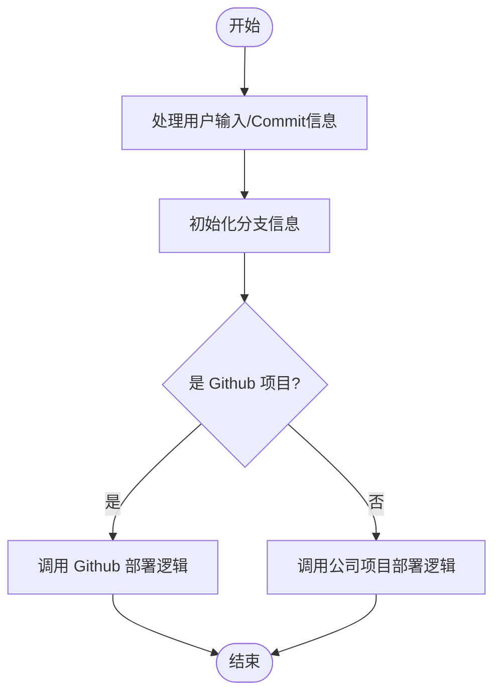
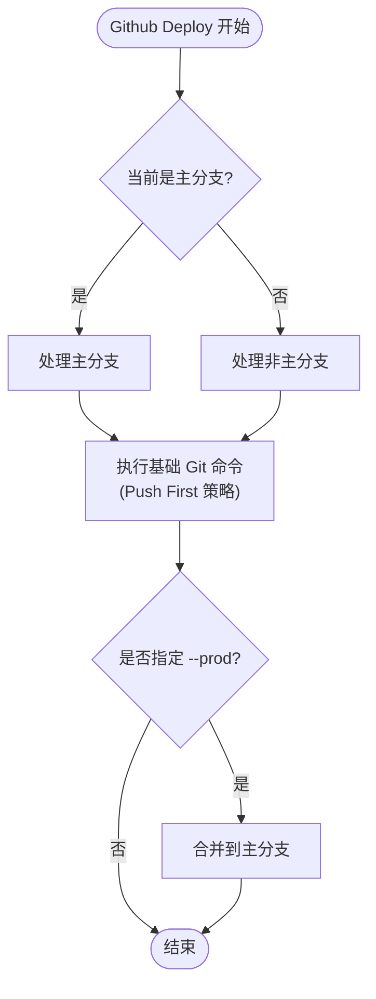
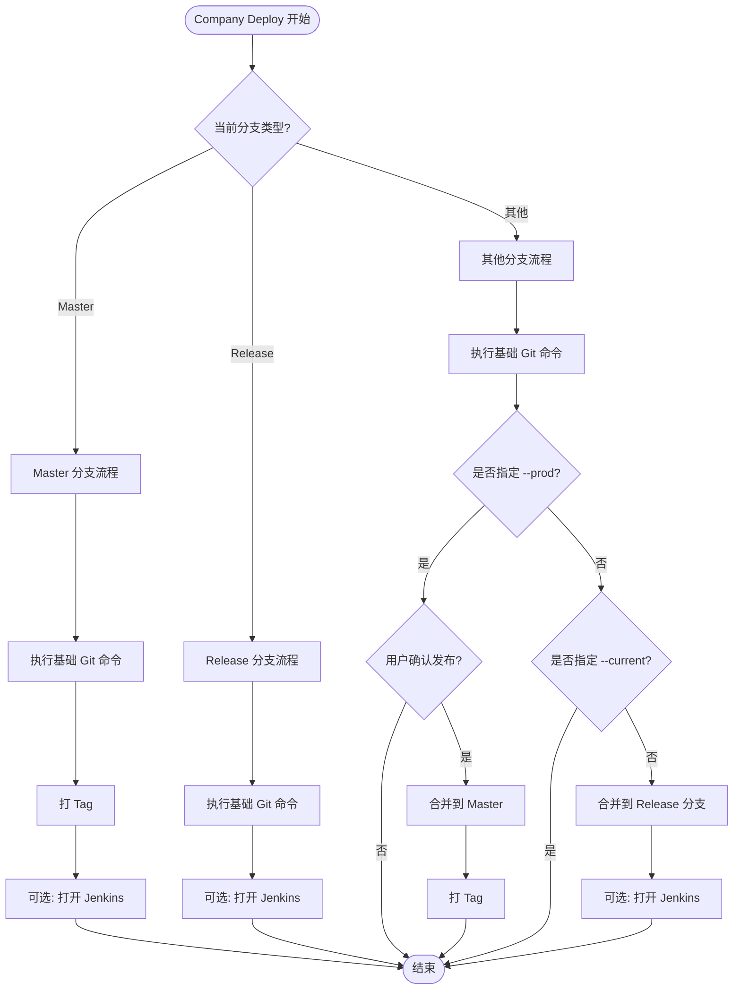

# Git Deploy 模块产品文档

## 1. 简介

`git/deploy` 模块是一个智能化的代码部署工具，旨在简化开发者的日常 Git 操作流程。它能够自动识别项目类型（GitHub 开源项目或公司内部项目），并根据当前分支状态执行相应的部署策略，包括代码提交、推送、合并分支以及触发 CI/CD 流程。

## 2. 核心价值

-   **极致效率**: 将 `git add`, `git commit`, `git pull`, `git push` 等繁琐的命令封装为一个动作，大幅减少键盘输入。
-   **智能适配**: 自动区分 GitHub 项目和公司内部项目，采用不同的代码同步策略（如 GitHub 的 Push-First 策略）。
-   **流程规范**: 强制规范化提交信息，自动处理分支合并（如开发分支 -> release/master），确保代码流向清晰。
-   **无缝集成**: 对于公司项目，支持自动打 Tag 和打开 Jenkins 部署页面，打通开发到部署的最后一步。

## 3. 用户故事

-   **日常开发提交**:
    > 作为一名开发者，在完成一个功能点后，我希望只需输入 `deploy` 并填写提交信息，就能自动完成代码的暂存、提交和推送到远程分支，而无需担心冲突或忘记 Push。

-   **发布测试环境**:
    > 作为一名开发者，在开发分支完成开发后，我希望通过 `deploy` 命令自动将代码合并到 `release` 分支并推送到远程，以便测试环境能够自动构建，而不需要手动切换分支进行合并。

-   **发布生产环境**:
    > 作为一名 Tech Lead，在准备发布版本时，我希望通过 `deploy --prod` 命令，将经过测试的代码自动合并到 `master` 分支，并自动打上版本 Tag，确保发布过程的严谨和可追溯。

## 4. 业务流程图

### 4.1 总入口分流逻辑
`deployService` 作为总入口，负责初始化环境并根据项目类型将请求分发给具体的处理策略。

### 4.2 GitHub 项目部署流程
针对开源项目的轻量级部署策略，核心是 **Push-First** 机制。

### 4.3 公司项目部署流程
针对企业内部项目的规范化部署策略，包含严格的分支管理和 CI/CD 集成。

## 5. 功能详情

### 5.1 基础 Git 自动化
-   **智能状态检查**: 在执行前检查 Git 状态，如有未提交变更则自动添加并提交。
-   **自动同步**: 根据远程分支状态，智能判断是直接 Push 还是先 Pull 后 Push。
-   **冲突处理**: 在 Pull 过程中如果遇到冲突，会尝试自动提交合并变更；若失败则提示用户手动解决。

### 5.2 GitHub 项目策略
-   采用 **Push-First** 策略：优先尝试 Push，如果失败（如远程有更新）则回退到 Pull -> Push 流程。这对于多人协作较少的开源项目能显著提高速度。
-   支持非主分支开发，通过 `--prod` 参数一键合并到主分支。

### 5.3 公司项目策略
-   **Master 分支**: 严格的发布流程，强制打 Tag。
-   **Release 分支**: 测试环境部署流程。
-   **Feature 分支**: 
    -   默认模式：自动合并代码到 `release` 分支，方便测试。
    -   Prod 模式：经过确认后合并到 `master` 分支并打 Tag，用于上线。
-   **Jenkins 集成**: 支持根据项目类型自动打开对应的 Jenkins 构建页面。
