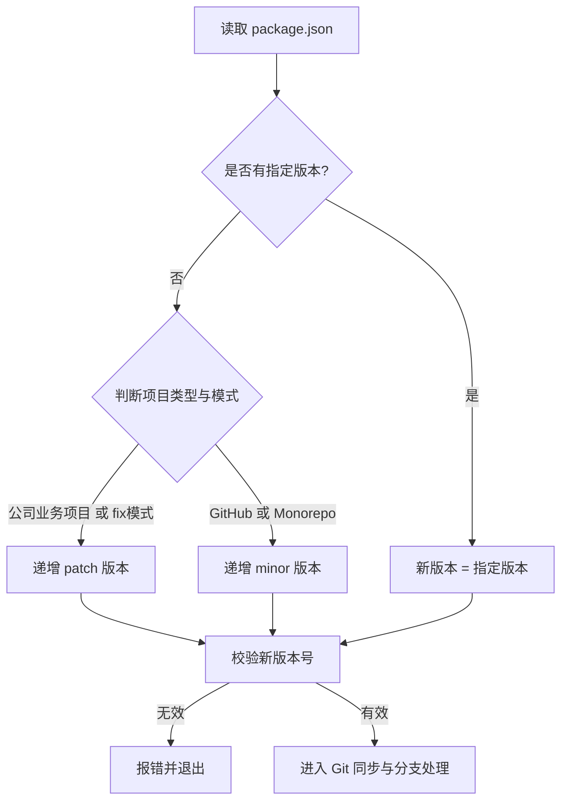
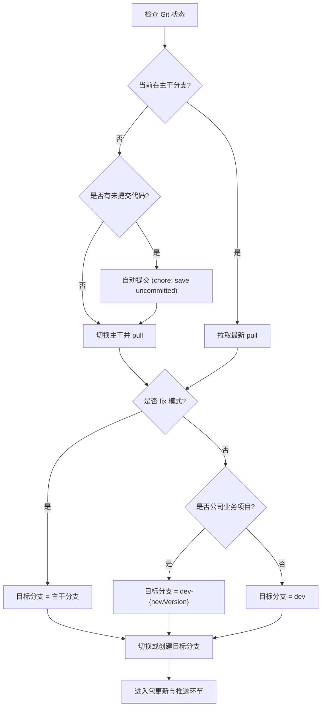
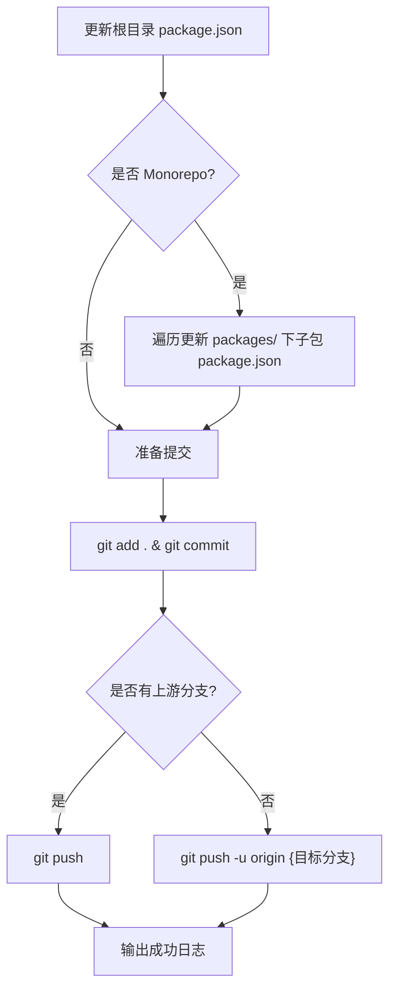

# iteration 命令产品说明书

## 1. 核心价值 (Value Proposition)

提供智能、自动化的工程版本迭代和 Git 分支管理。通过分析项目类型（GitHub 开源项目、公司 Monorepo 项目、公司业务项目），自动推断下一个合理的版本号，完成代码同步、分支创建以及多层级 `package.json` 的版本更新和远程代码推送，规范团队迭代流程，减少手动操作和出错率。

## 2. 用户故事 (User Stories)

-   作为 **开发者**，我希望在开始新迭代时，**系统能自动根据当前项目类型递增二级或三级版本，并创建或切换到相应的开发分支**，以便于**统一团队版本规范，减少繁琐的切分支和修改版本号的动作**。
-   作为 **Monorepo 项目维护者**，我希望在版本升级时，**能够一次性更新根目录以及 packages 下所有子包的版本号**，以便于**保持版本一致性**。
-   作为 **项目维护者**，我希望在修复线上问题时（使用 `--fix`），**能够在主干分支直接增加 patch 版本并提交**，以便于**快速完成热修复流程**。

## 3. 功能特性 (Features)

-   [x] **智能项目识别**：自动判断当前工程是否为 GitHub 开源项目、Monorepo 项目或公司普通业务项目。
-   [x] **动态版本推断**：支持自动递增版本号（GitHub 和 Monorepo 默认增加 minor，公司业务或 fix 模式下增加 patch），并支持手动指定版本号。
-   [x] **全景分支管理**：自动检查未提交代码并保存，拉取最新主干代码，根据项目类型切换到指定开发分支（如 `dev-{newVersion}` 或 `dev`）。
-   [x] **全局版本更新**：自动更新根目录的 `package.json`；若为 Monorepo 项目，则自动遍历更新 `packages/` 目录下所有子包的版本号。
-   [x] **自动化提交流程**：完成修改后自动执行 `git add`, `git commit` 以及 `git push`，如果当前分支无上游则自动设置上游追踪。

## 4. 命令行参数 (Command Arguments)

该命令接受以下选项参数来控制版本更新行为：

| 参数名    | 简写 | 类型      | 必填 | 默认值  | 描述                                                               |
| :-------- | :--- | :-------- | :--- | :------ | :----------------------------------------------------------------- |
| `version` | 无   | `string`  | 否   | 无      | 可选的指定版本号。如果不提供，则根据项目类型自动计算递增版本。     |
| `--fix`   | 无   | `boolean` | 否   | `false` | 修复模式。指定时，版本递增类型固定为 patch，并在主分支上进行更新。 |

**参数逻辑说明**：

-   如果提供了 `version` 参数，则将其作为新版本号并进行格式校验。
-   如果未提供 `version` 参数且未启用 `--fix`，GitHub 和 Monorepo 项目将递增 `minor`，公司业务项目递增 `patch`。
-   如果启用了 `--fix`，强制递增 `patch` 版本。

## 5. 交互设计 (User Experience)

**输入示例 1（常规业务项目迭代）**：

```bash
$ mycli git iteration
```

**预期输出样式**：

```text
项目类型: 公司 普通项目
当前版本: 1.0.0
新版本: 1.0.1
切换到主干分支 master 并拉取最新代码...
基于主干创建并切换到 dev-1.0.1 分支...
正在更新 package.json 版本号...
提交版本变更并推送到远端...
成功推送到远程并设置上游分支
操作完成！当前处于 dev-1.0.1 分支，版本号已更新为 1.0.1
```

## 6. 技术实现 (Technical Implementation)

由于该命令包含复杂的项目类型判定和分支策略分流，其执行流程被拆分为以下三个核心子流程。

### 6.1 版本推断子流程 (Version Inference Flow)

负责确定最终需要升级到的目标版本号。



### 6.2 Git 同步与分支策略子流程 (Git Sync & Branch Strategy Flow)

负责处理主干代码的同步，并根据项目类型分配到对应的开发分支。对于已存在的 `dev-{version}` 分支，会触发交互式提示要求重新输入版本号。



### 6.3 更新包与推送策略子流程 (Update & Push Flow)

负责执行版本号的物理更新，并完成最终的 Git 提交流程。



## 7. 约束与限制 (Constraints)

-   **执行环境**：强依赖当前执行目录存在有效的 `package.json` 文件。
-   **分支假设**：内部使用 `getMainBranchName` 获取主干分支，通常为 `master` 或 `main`。
-   **Monorepo 结构**：目前仅支持约定式结构，即子包必须统一存放在 `packages/` 目录下。
