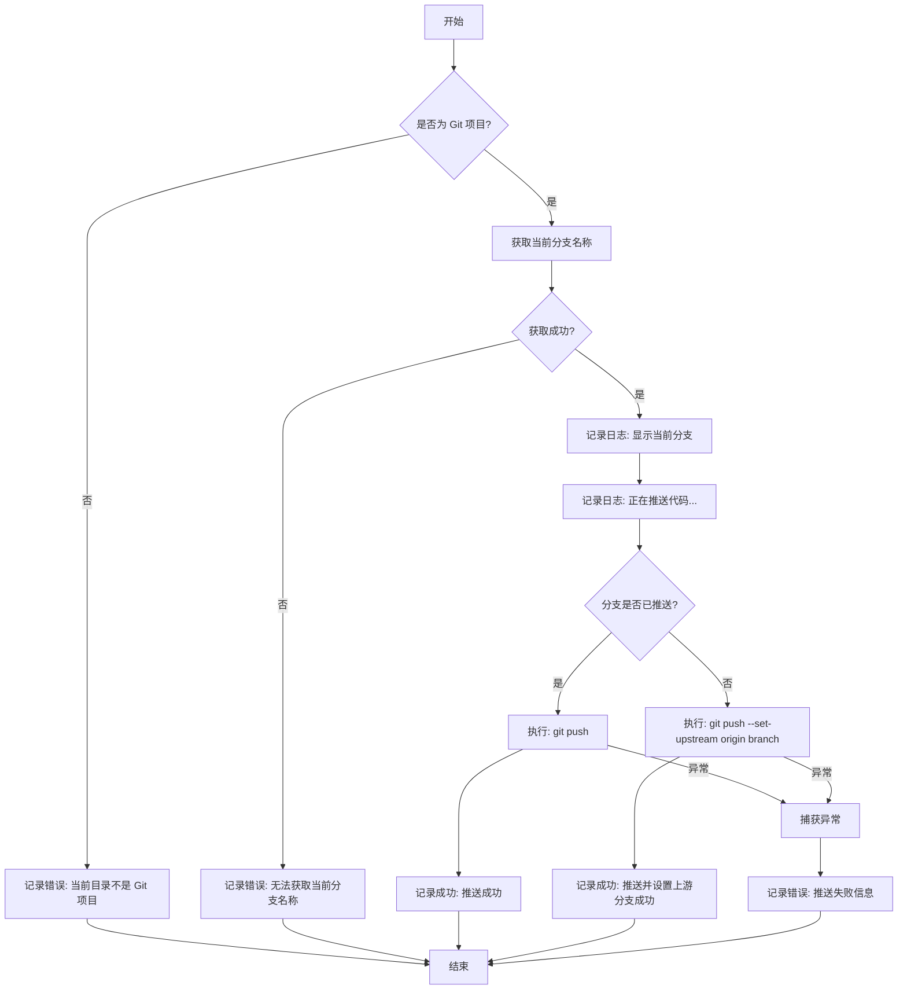

# Git Push Command

## Core Value (核心价值)

简化 Git 代码推送流程，通过智能检测当前分支状态，自动处理上游分支（upstream）的设置。开发者无需记忆复杂的 `git push --set-upstream origin <branch_name>` 命令，只需执行简单的 `push` 指令即可完成代码提交，提升日常开发效率。

## User Stories (用户故事)

- **场景一：日常开发推送**
  作为一名开发者，我在本地分支完成代码提交后，希望直接推送代码到远程，而不需要关心当前分支是否已经关联了远程分支。
- **场景二：新分支首次推送**
  作为一名开发者，当我新建一个本地分支并首次推送时，希望工具能自动帮我建立与远程 `origin` 的关联，而不是报错提示我需要设置 upstream。
- **场景三：非 Git 环境保护**
  作为一名用户，如果我不小心在非 Git 项目目录下执行了推送命令，我希望工具能明确告知我当前环境错误，而不是抛出难以理解的系统异常。

## Features (功能特性)

1.  **环境智能检测**：运行前自动检查当前目录是否为有效的 Git 项目。
2.  **分支自动识别**：自动获取当前所在的 Git 分支名称。
3.  **智能上游设置**：
    -   如果当前分支已有对应的远程分支，直接执行普通推送。
    -   如果当前分支未推送到远程，自动执行带 `--set-upstream` 的推送命令。
4.  **清晰的反馈**：提供详细的执行进度和结果日志（成功/失败）。

## Usage (使用方法)

```bash
# 在项目根目录下执行
mycli git push
```

> **注意**：该命令目前不接受任何参数，全自动处理。

## Technical Implementation (技术实现)

该命令的核心逻辑位于 `service.ts` 中，主要流程如下：

1.  **前置检查**：验证 Git 环境。
2.  **信息获取**：获取当前分支名。
3.  **状态判断**：检查当前分支是否已存在于远程。
4.  **差异化执行**：根据状态选择执行 `git push` 或 `git push --set-upstream`。

### 流程图



## Constraints (约束与限制)

1.  **远程仓库命名**：默认假设远程仓库名为 `origin`，暂不支持自定义远程仓库名称。
2.  **交互性**：不支持在推送过程中处理需要交互式输入的鉴权场景（依赖用户环境已配置好的 SSH Key 或凭证管理器）。
3.  **强制推送**：当前实现暂未暴露 `--force` 选项，仅支持安全的常规推送。
