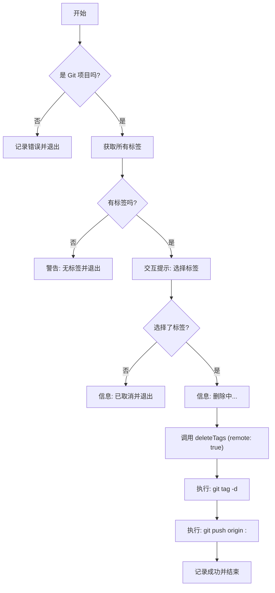

# Product Doc: Git Tag Deleter

## 1. Value Proposition (核心价值)

`git tag delete` 提供了一个高效的交互式界面，用于批量清理本地和远程的 Git 标签。它解决了手动逐个删除标签的繁琐问题，帮助开发者快速维护仓库的整洁性。

## 2. User Stories (用户故事)

-   **作为一名开发者**，我的本地仓库积累了大量过时的测试标签，我希望能够通过一个列表快速选择并批量删除它们，而不是运行几十次 `git tag -d`。
-   **作为一名维护者**，我需要清理远程仓库中的错误标签，我希望能在一个操作中同时删除本地和远程的对应标签，确保一致性。

## 3. Features (功能特性)

-   **交互式选择**: 提供可视化的复选框列表，展示所有本地标签。
-   **批量操作**: 支持一次性选择多个标签进行删除。
-   **双端同步删除**: 删除本地标签的同时，自动尝试删除远程仓库对应的标签。
-   **安全检查**: 在操作前确认是否为 Git 项目，以及是否有标签可供删除。

## 4. Command Arguments (命令行参数)

该命令是一个交互式命令，通常不需要额外的参数。
-   调用方式：`git tag delete` (具体取决于 CLI 路由配置)

## 5. User Experience (交互设计)

1.  **启动**: 用户运行删除命令。
2.  **检查**: 系统检查环境和现有标签。
3.  **交互**: 显示一个包含所有标签的复选框列表。用户使用空格键选择，回车键确认。
4.  **反馈**:
    -   如果未选择，提示操作取消。
    -   如果选择，显示正在删除的进度。
    -   删除完成后，显示成功信息。

## 6. Technical Implementation (技术实现)

### Main Logic Flow

## 7. Constraints (约束与限制)

-   依赖 `inquirer` 库提供交互式界面。
-   删除远程标签需要相应的 Git 权限和网络连接。
-   如果远程标签不存在（已被他人删除），操作应能容错处理。
