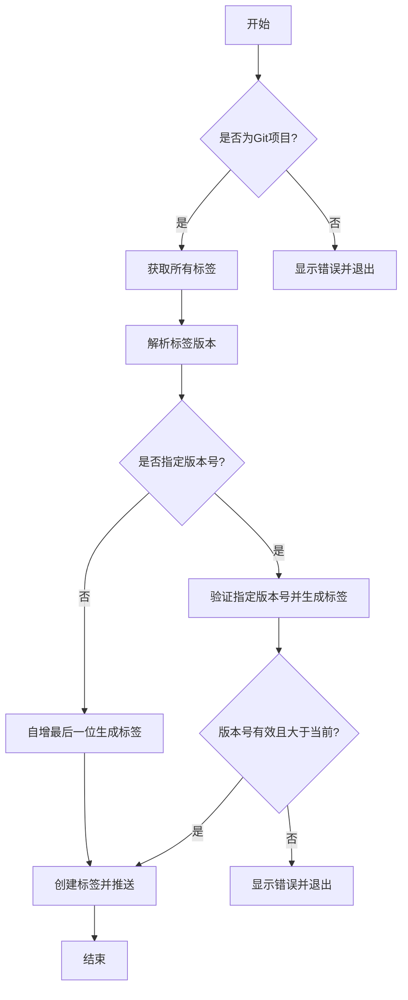
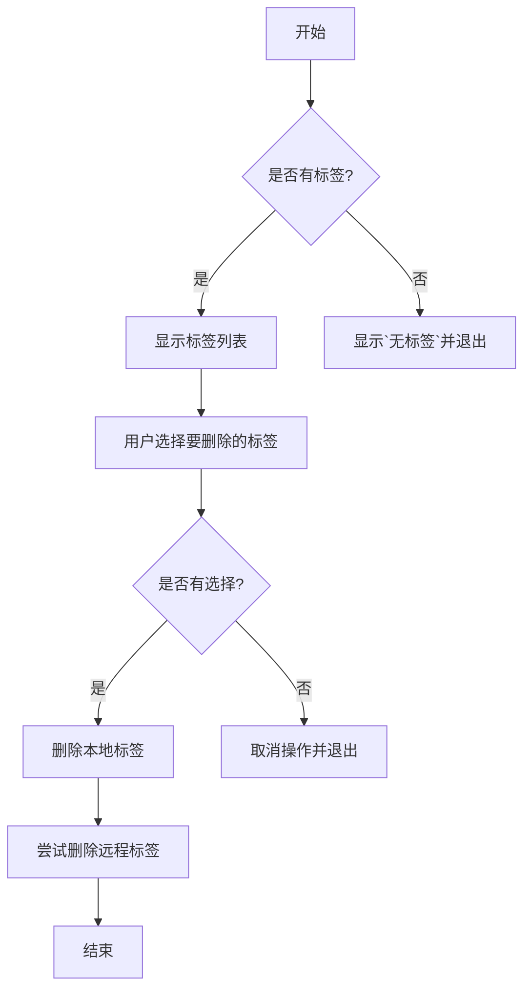
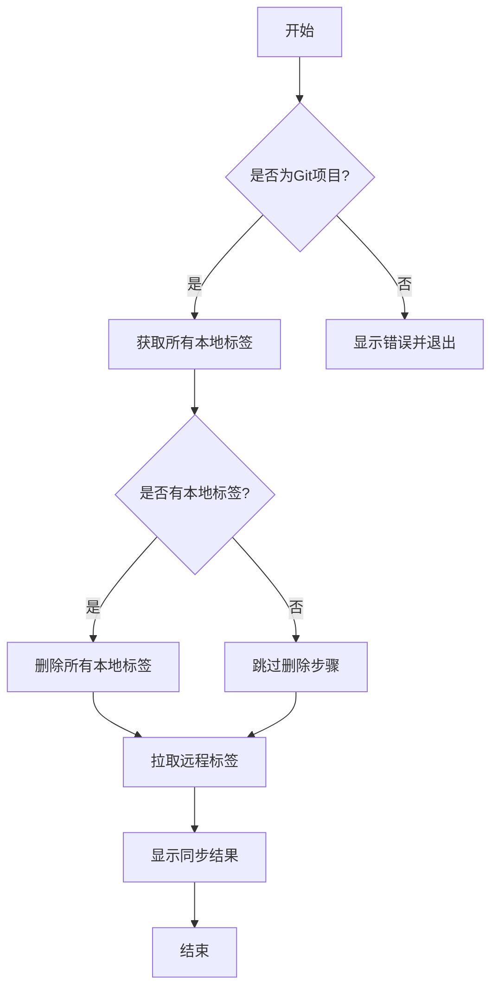

# git tag 命令实现计划

## 功能概述

`git tag` 命令用于管理 Git 项目的标签，该命令实现以下功能：

1. 添加新标签并推送到远程仓库
2. 批量删除本地和远程标签
3. 同步远程仓库的标签到本地

## 添加标签(默认命令)

### 功能

-   自动基于现有标签生成新的版本号
-   支持指定版本号（必须是 3 段式且大于当前最新版本）
-   支持指定标签前缀类型（默认为 v）
-   自动将新标签推送到远程仓库

### 版本号规则

-   如果不指定版本，则基于最新版本自增最后一位
    -   例如：当前最新版本是 v4.9.5，下一个版本将是 v4.9.5.1
    -   如果已经是四段式版本号，如 v4.9.5.3，下一个版本将是 v4.9.5.4
-   如果指定版本，则只接受三段式版本号，且必须大于当前最新版本
    -   例如：当前最新版本是 v4.9.5，可以指定 v4.9.6, v4.10.0 或 v5.0.0，但不能设置 v4.9.4

### 实现细节

1. 检查当前目录是否是 Git 项目
2. 获取所有标签
3. 根据指定的类型前缀过滤标签
4. 解析所有标签版本号并找出最大版本
5. 根据是否指定版本号，生成新标签
6. 创建本地标签并推送到远程仓库



## 删除标签(delete 子命令)

### 功能

-   列出所有本地标签供用户选择
-   批量删除选中的本地标签
-   尝试删除对应的远程标签（如果远程不存在则忽略）

### 实现细节

1. 检查当前目录是否是 Git 项目
2. 获取所有本地标签
3. 提示用户选择要删除的标签
4. 删除所选本地标签
5. 尝试删除对应的远程标签



## 同步标签(sync 子命令)

### 功能

-   删除所有本地标签
-   从远程仓库拉取所有标签
-   保持本地和远程标签同步

### 实现细节

1. 检查当前目录是否是 Git 项目
2. 获取所有本地标签
3. 删除所有本地标签
4. 从远程仓库拉取所有标签



## 导出功能

将核心的生成新标签的逻辑导出为独立函数，供其他模块使用：

```typescript
export const generateNewTag = async (tags: string[], type: string = 'v', version?: string): Promise<string> => {
    // 实现逻辑...
};
```

## 错误处理

处理以下可能出现的错误：

-   当前目录不是 Git 项目
-   指定的版本号格式不符合要求
-   指定的版本号小于当前最新版本
-   Git 操作失败(网络错误、权限问题等)
