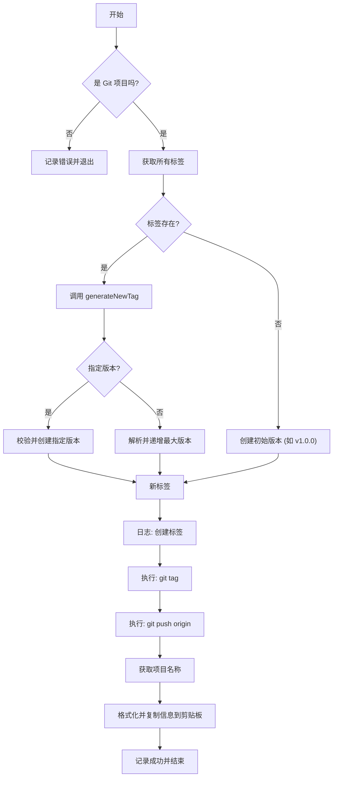

# Product Doc: Git Tag Generator

## 1. Value Proposition (核心价值)

`git tag get` (默认命令) 旨在解决 Git 项目版本管理中的痛点。它通过自动化版本号计算和标签创建流程，确保版本号的规范性和连续性，减少人工操作失误，提升发布效率。

## 2. User Stories (用户故事)

-   **作为一名开发者**，在完成新功能开发准备发布时，我希望能够自动生成下一个符合规范的版本号（如从 v1.0.0 自动变为 v1.0.1），而不需要手动检查现有标签。
-   **作为一名团队负责人**，我希望团队成员遵循统一的版本号规范（三段式或四段式），通过工具强制执行此规范，避免出现不规则的标签。
-   **作为一名发布工程师**，我希望在创建标签后能自动推送到远程仓库，并自动生成包含项目信息的发布文案，以便快速通知团队。

## 3. Features (功能特性)

-   **智能版本计算**: 自动解析现有标签，基于语义化版本规范（SemVer）计算下一个版本号。
-   **灵活的版本控制**: 支持自动递增（默认补丁号自增）或指定特定版本号。
-   **多环境支持**: 支持自定义标签前缀（默认为 `v`），适应不同的发布线（如 `test-`, `prod-`）。
-   **自动化工作流**: 集成 `git tag` 创建、`git push` 推送和剪贴板复制功能。
-   **校验机制**: 严格校验指定版本号的格式和大小，防止回退或错误格式。

## 4. Command Arguments (命令行参数)

该命令通常通过 `git tag` 或别名调用，支持以下参数：

-   `version` (可选): 指定具体的版本号（如 `1.0.2`）。如果不提供，则自动递增。
-   `--type` (可选): 标签前缀，默认为 `v`。
-   `--msg` (可选): 附加的更新说明信息，将包含在复制的文案中。

## 5. User Experience (交互设计)

用户执行命令后，工具将：
1.  检查当前目录是否为 Git 项目。
2.  扫描现有标签并计算新版本。
3.  在终端显示正在创建的标签信息。
4.  执行 Git 操作（创建和推送）。
5.  成功后，显示绿色的成功提示，并将格式化的发布信息（包含项目名、Tag、更新内容）复制到剪贴板。

## 6. Technical Implementation (技术实现)

### Main Logic Flow

### Key Functions
-   `parseVersion`: 解析标签字符串为 `VersionInfo` 对象。
-   `findMaxVersion`: 在版本列表中查找最大版本。
-   `generateNewTag`: 核心逻辑，根据策略生成新标签字符串。

## 7. Constraints (约束与限制)

-   必须在 Git 项目根目录下运行。
-   指定版本号必须符合 SemVer 格式（X.Y.Z 或 X.Y.Z.B）。
-   指定版本号必须大于当前已存在的最大版本号。
-   依赖 Git 命令行工具和网络连接（用于推送）。
