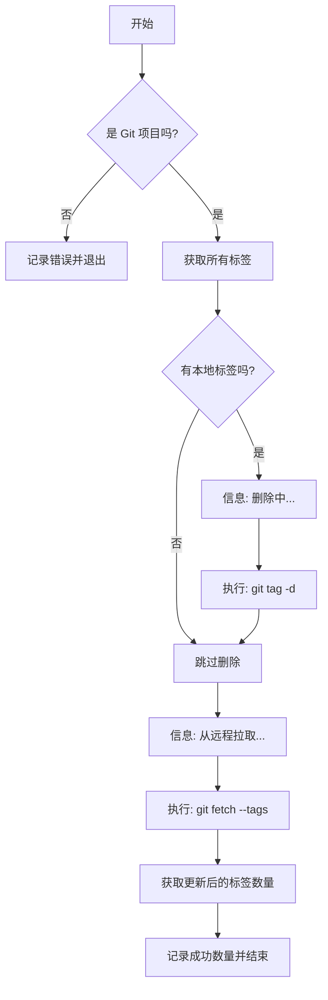

# Product Doc: Git Tag Synchronizer

## 1. Value Proposition (核心价值)

`git tag sync` 提供了一种强制同步机制，确保本地标签与远程仓库完全一致。它适用于解决本地标签混乱、过期或与远程状态不一致的问题，为开发者提供一个“重置”标签状态的一键解决方案。

## 2. User Stories (用户故事)

-   **作为一名新加入项目的开发者**，我希望确保我的本地标签与团队的远程仓库完全一致，以便我能基于正确的版本进行开发。
-   **作为一名开发者**，由于多人协作，远程仓库删除了很多旧标签，但我的本地还保留着。我希望一键清理本地多余标签并拉取最新列表。

## 3. Features (功能特性)

-   **全量清理**: 自动检测并删除所有本地标签，清除历史包袱。
-   **全量拉取**: 从远程仓库重新拉取所有标签 (`git fetch --tags`)。
-   **自动化执行**: 无需人工干预，一键完成“清理-拉取”闭环。

## 4. Command Arguments (命令行参数)

该命令通常不需要参数。
-   调用方式：`git tag sync` (具体取决于 CLI 路由配置)

## 5. User Experience (交互设计)

1.  用户运行同步命令。
2.  系统提示正在删除本地标签（如果存在）。
3.  系统提示正在从远程拉取标签。
4.  操作完成后，显示同步后的标签总数。

## 6. Technical Implementation (技术实现)

### Main Logic Flow

## 7. Constraints (约束与限制)

-   **破坏性操作**: 会删除所有本地标签。虽然大部分情况下标签都存储在远程，但如果用户有未推送到远程的本地私有标签，将会丢失。建议在文档中明确警告。
-   依赖网络连接以执行 fetch 操作。
