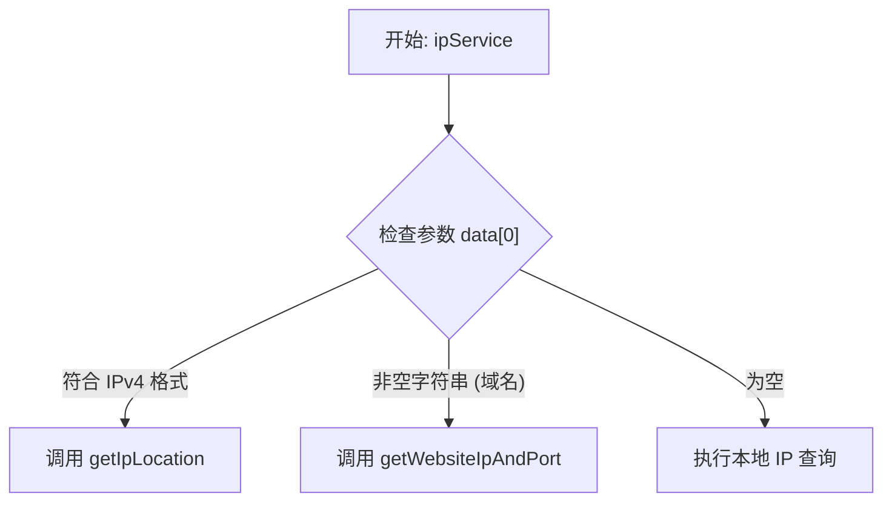
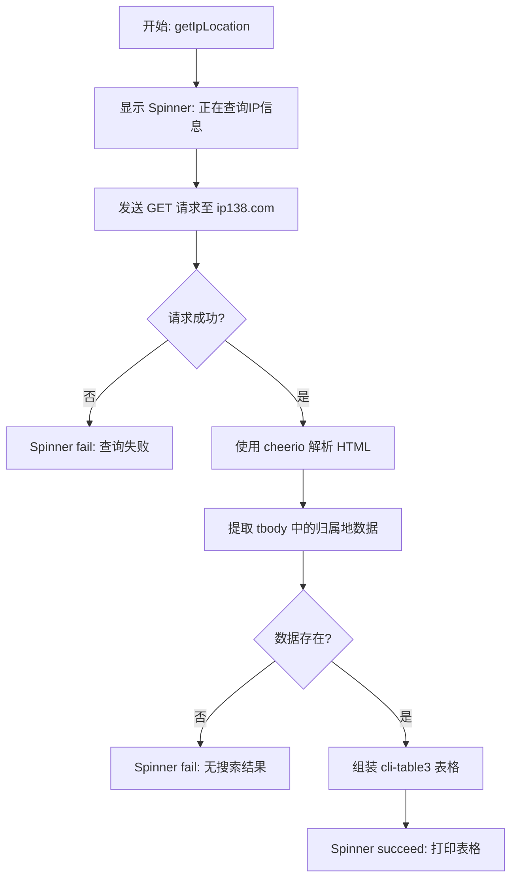
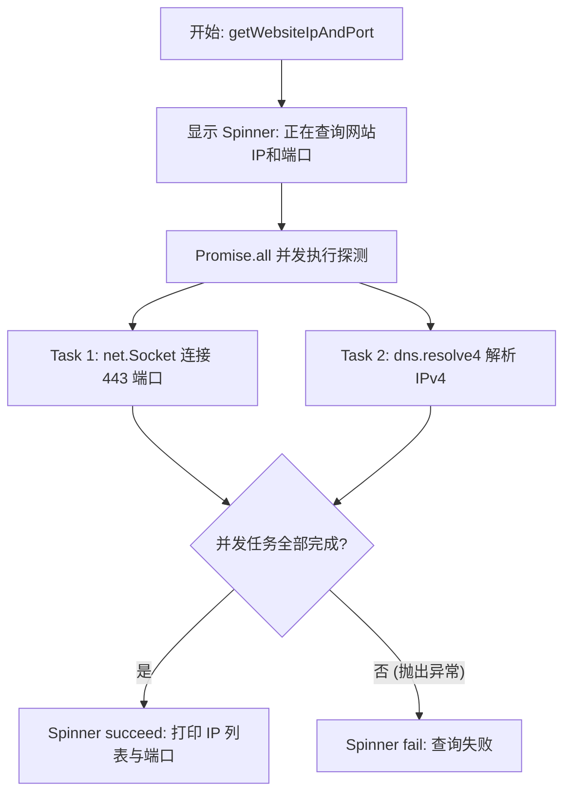
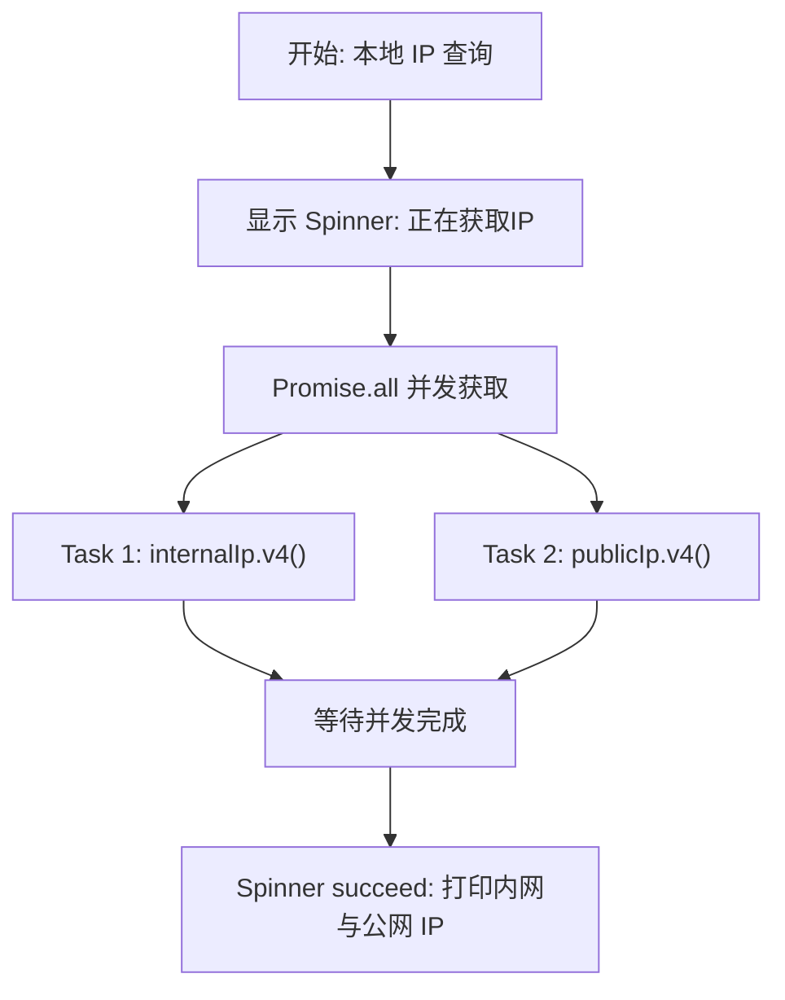

# IP 信息查询产品说明书

## 1. 核心价值 (Value Proposition)

为开发者和系统管理员提供一个快速、便捷的命令行网络工具。通过一条命令，用户可以轻松获取本机内外网 IP、查询任意 IP 的物理归属地及运营商信息，或者探测目标网站的解析 IP 与开放端口，从而大幅提升网络调试和排障效率。

## 2. 用户故事 (User Stories)

- 作为 **后端开发者**，我希望**快速获取本机的内网和公网 IP**，以便于**在配置回调接口、联调服务或设置白名单时提供正确的地址**。
- 作为 **系统运维人员**，我希望**通过命令行查询某个可疑 IP 的归属地**，以便于**在分析服务器访问日志时快速判断来源区域和运营商**。
- 作为 **网络排障人员**，我希望**快速探测某个域名的解析 IP 及 443 端口连通性**，以便于**验证 DNS 解析是否生效或目标网站是否正常提供 HTTPS 服务**。

## 3. 功能特性 (Features)

- [x] **本地 IP 获取**：并发获取本机的内网 IPv4 和公网 IPv4 地址。
- [x] **IP 归属地查询**：精确查询指定 IPv4 地址的地理位置（国家/省/市）和网络运营商信息。
- [x] **网站探测**：解析目标域名的 IPv4 地址，并验证其 443 端口的连通性。
- [x] **可视化输出**：使用 CLI Table 格式化展示归属地信息，并使用颜色高亮突出关键数据。

## 4. 命令行参数 (Command Arguments)

该命令接受一个可选的位置参数：

| 参数名 | 类型 | 必填 | 默认值 | 描述 |
| :--- | :--- | :--- | :--- | :--- |
| `data[0]` | `string` | 否 | 无 | 要查询的 IP 地址或网站域名。如果不提供，则查询本地 IP。 |

**参数逻辑说明**：

- **IPv4 地址**：如果输入符合标准 IPv4 格式（如 `8.8.8.8`），则触发 IP 归属地查询。
- **网站域名**：如果输入为普通字符串（如 `google.com`），则触发网站 IP 和端口查询。
- **空参数**：如果不带任何参数，则触发本地内外网 IP 查询。

## 5. 交互设计 (User Experience)

**输入示例**：

```bash
# 查询本地 IP
$ mycli ip

# 查询 IP 归属地
$ mycli ip 8.8.8.8

# 查询网站 IP 和端口
$ mycli ip baidu.com
```

**预期输出样式**：

*本地 IP 查询*：
```text
✔ 内网IP: 192.168.1.100
  公网IP: 114.114.114.114
```

*IP 归属地查询*：
```text
✔ 查询成功
┌─────────┬──────────────────┐
│ IP      │ 8.8.8.8          │
├─────────┼──────────────────┤
│ 归属地  │ 美国             │
├─────────┼──────────────────┤
│ 运营商  │ 谷歌             │
└─────────┴──────────────────┘
```

## 6. 技术实现 (Technical Implementation)

### 6.1 总入口分流图 (Main Dispatch Flow)

根据用户输入的参数类型，命令会自动分发到不同的处理子流程中。



### 6.2 具体执行图 (Sub-Flows)

#### 6.2.1 IP 归属地查询子流程



#### 6.2.2 网站 IP 和端口查询子流程



#### 6.2.3 本地 IP 查询子流程



### 6.3 核心逻辑说明

1. **IP 归属地解析**：利用 `axios` 设置请求超时（10s）并模拟浏览器 UA 请求 `ip138.com`。由于返回的是 HTML 页面，使用 `cheerio` 进行 DOM 树解析，提取目标 `tbody` 标签中的键值对。
2. **网站探测机制**：通过 Node.js 原生 `node:net` 模块建立 Socket 连接探测端口开放状态，同时使用 `node:dns` 模块进行底层 DNS 解析，两者并发执行以提高响应速度。
3. **本地 IP 获取**：集成 `internal-ip` 和 `public-ip` 第三方库，分别通过读取系统网卡接口和请求外部反射服务器来获取本地和公网 IPv4 地址。为了优化性能，目前仅获取 IPv4，规避了 IPv6 获取耗时过长的问题。

## 7. 约束与限制 (Constraints)

- **外部依赖风险**：IP 归属地查询强依赖 `ip138.com` 的页面结构和可用性，若目标网站改版或触发防爬虫机制，该功能将失效。
- **端口探测局限**：网站探测目前写死了连接 `443` 端口，对于仅提供 HTTP (80 端口) 或其他自定义端口的服务，探测可能会失败。
- **网络环境限制**：本地公网 IP 获取以及 DNS 解析功能依赖于当前执行环境的网络连通性，在纯内网或断网环境下将无法正常工作。