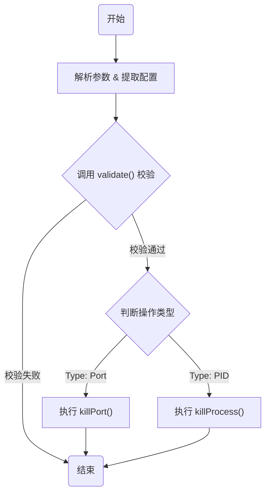
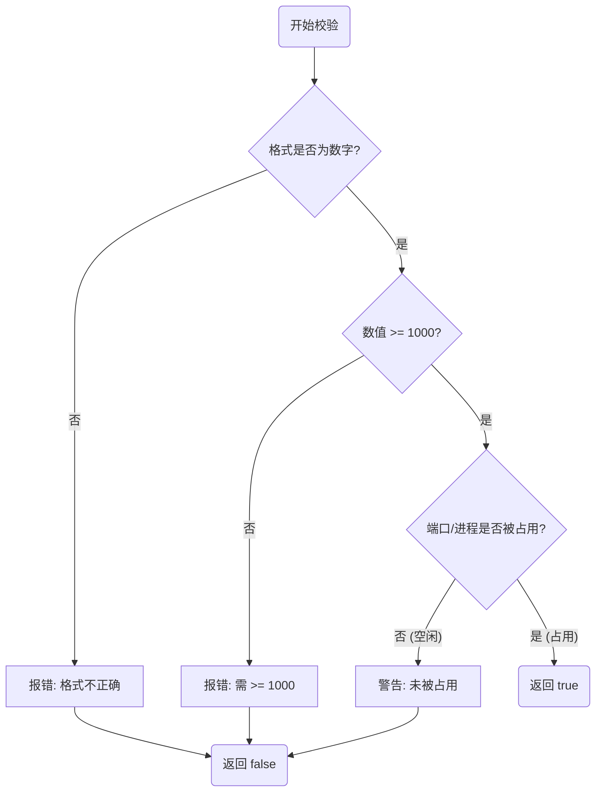
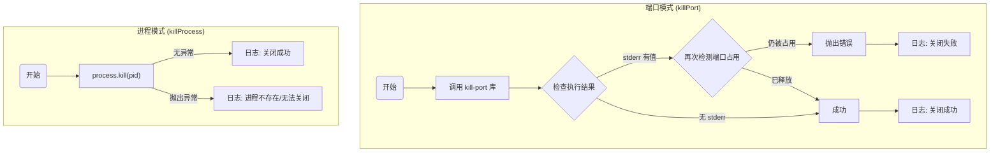

# Kill (进程/端口终止)

该模块提供了一个便捷的 CLI 工具，用于通过端口号或进程 ID (PID) 快速终止系统进程。

## 核心价值

在开发过程中，经常遇到端口被占用（如 `EADDRINUSE` 错误）或服务进程卡死的情况。手动查找 PID 并执行 `kill` 命令繁琐且容易出错。本模块提供了一键释放端口或关闭指定进程的能力，极大地简化了开发环境的维护工作，提升开发效率。

## 用户故事

-   **场景一：端口冲突**
    作为一名前端开发者，当我尝试启动开发服务器时提示 `8080` 端口被占用，我希望通过 `mycli kill 8080` 直接释放该端口，而不需要去记忆复杂的系统命令来查找和杀死进程。

-   **场景二：僵尸进程清理**
    作为一名全栈开发者，当我发现某个后台服务进程（PID: 12345）卡死且无法通过常规方式退出时，我希望通过 `mycli kill pid 12345` 强制结束该进程。

## 功能特性

-   **多模式支持**：支持按**端口号**或**进程 ID**终止进程。
-   **智能参数解析**：支持 `kill 8080` (默认端口模式) 和显式指定类型 `kill pid 12345`。
-   **安全校验**：
    -   仅允许操作 1000 以上的端口/PID，保护系统关键进程。
    -   操作前自动检测端口/进程占用状态，避免误操作。
-   **反馈友好**：提供清晰的成功或失败日志，支持静默模式。

## 命令行参数

参考 `types.ts` 和 `service.ts` 的定义：

-   `type`: 操作类型，可选 `port` (默认) 或 `pid`。
-   `value`: 具体的端口号或进程 ID (必须 >= 1000)。
-   `options`: 配置项，例如 `{ log: boolean }` 控制日志输出。

## 技术实现

核心逻辑位于 `service.ts` 中。为了清晰展示处理过程，我们将流程拆分为**核心控制流**、**参数校验流**和**执行操作流**。

### 1. 核心控制流 (Core Control Flow)

主入口 `killService` 负责协调参数解析、校验和任务分发。

### 2. 参数校验流 (Validation Logic)

`validate` 函数确保输入参数合法且目标进程/端口存在，避免无效操作。

### 3. 执行操作流 (Execution Logic)

根据不同类型调用底层的系统命令或库函数。

### 关键依赖

-   `kill-port`: 用于跨平台终止端口进程。
-   `detect-port`: 用于检测端口占用情况。
-   `chalk`: 用于美化日志输出。

## 交互设计

用户通过命令行输入指令，系统根据执行结果在控制台输出带颜色的日志：
-   **成功**：绿色/黄色高亮提示关闭成功。
-   **警告**：黄色提示端口未被占用。
-   **错误**：红色提示参数错误或关闭失败。

## 约束与限制

1.  **系统权限**：终止某些进程可能需要管理员权限（sudo/Run as Administrator）。
2.  **安全范围**：为防止误关系统进程，硬编码限制了只能操作 1000 以上的端口或 PID。
3.  **本地限制**：仅支持操作本地机器的进程，不支持远程操作。
