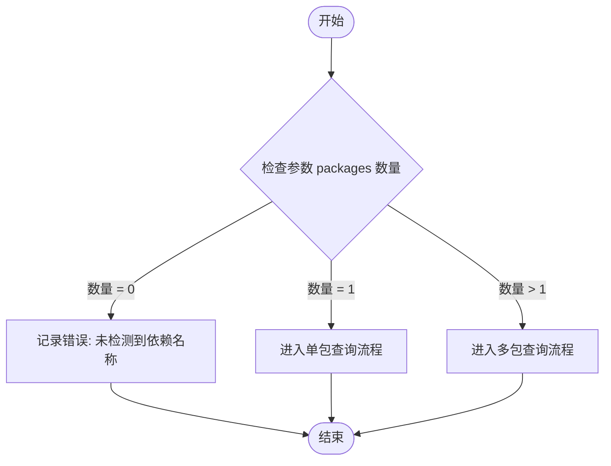
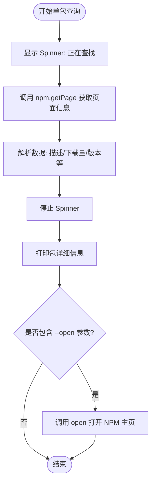
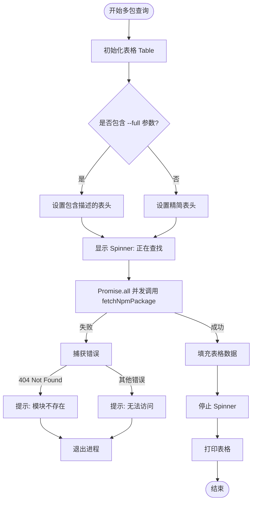

# NPM Search 模块

## 核心价值

为开发者提供便捷的 NPM 包信息查询工具，无需离开终端即可快速获取包的描述、版本、下载量等关键信息，支持单包详情查看和多包对比，提升开发效率。

## 用户故事

- **作为一名开发者**，我想快速查看某个 NPM 包的最新版本和周下载量，以便评估是否引入该依赖。
- **作为一名开发者**，我想同时对比多个同类库的流行度（下载量）和维护状态（上次更新时间），以便做出选型决策。
- **作为一名开发者**，我想在查询包信息后直接打开其 NPM 主页查看详细文档，而不需要手动打开浏览器搜索。

## 功能特性

- **单包查询**：显示包名、描述、周下载量、上次更新时间、最新版本。
- **多包查询**：以表格形式展示多个包的信息，支持对比。
- **浏览器打开**：支持通过参数直接在默认浏览器中打开包的 NPM 主页。
- **详细模式**：在多包查询时，可选择是否显示完整描述信息。

## 命令行参数

| 参数 | 别名 | 描述 | 默认值 |
| --- | --- | --- | --- |
| `packages` | - | 要查询的包名列表（支持多个） | - |
| `--open` | `-o` | 在浏览器中打开包的主页（仅单包模式有效） | `false` |
| `--full` | `-f` | 在多包模式下显示完整描述 | `false` |

## 交互设计

- **加载状态**：查询过程中显示 Loading Spinner，提示正在查找。
- **结果展示**：
    - 单包：列表式详细展示。
    - 多包：表格展示，关键数据一目了然。
- **错误处理**：若包不存在或网络错误，显示友好的错误提示。

## 技术实现

### 流程图

#### 1. 主流程 (Main Dispatch Flow)

#### 2. 单包查询流程 (Single Package Flow)

#### 3. 多包查询流程 (Multiple Packages Flow)

## 约束与限制

- **网络依赖**：必须连接互联网才能访问 NPM Registry 获取数据。
- **数据源**：依赖于 `npm-view` 或类似的底层命令/API (通过 `../shared` 模块)，受限于 NPM 服务的可用性。
- **环境兼容性**：需要在支持 Node.js 的终端环境中运行。
