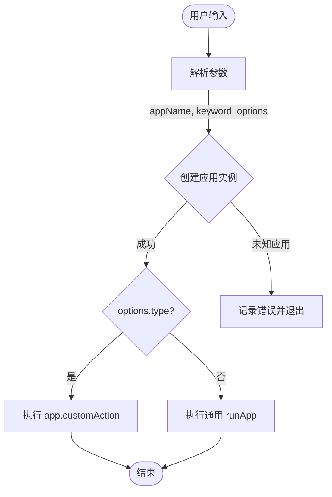
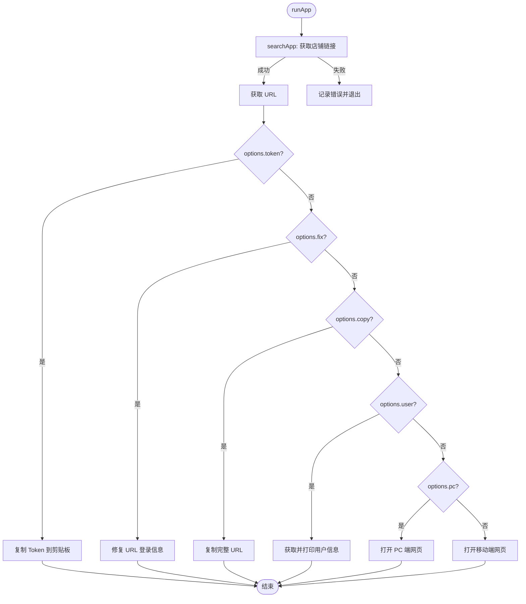

# Product Document: occ

## 1. Value Proposition (核心价值)

`occ` 模块是一个集成的业务管理工具，旨在为开发、测试和运营人员提供一个统一的入口，以便快速访问和管理公司旗下各业务线（如美团经营神器、评价神器、饿了么经营神器等）的店铺数据。

它解决了以下痛点：
- **入口分散**：不同业务线的后台地址、登录方式各不相同，记忆和查找成本高。
- **操作繁琐**：手动获取 Token、拼接 URL、切换环境（测试/正式）步骤多且易出错。
- **效率低下**：在日常排查问题或进行测试时，频繁的登录和跳转消耗大量时间。

通过 `occ` 命令，用户可以通过简单的命令行指令，一键完成店铺搜索、Token 获取、页面跳转等操作，极大地提升了工作效率。

## 2. User Stories (用户故事)

- **作为一名开发人员**，我希望能够快速获取指定店铺在测试环境的 Token，以便我可以在 Postman 中调试 API 接口。
- **作为一名运营人员**，我希望能够直接通过店铺 ID 打开该店铺的后台管理页面，以便我查看客户的经营数据。
- **作为一名测试人员**，我希望能够方便地在 PC 端和移动端页面之间切换，以便验证不同端的兼容性。
- **作为一名产品经理**，我希望能够查看店铺的版本和剩余有效期信息，以便确认客户的服务状态。

## 3. Features (功能特性)

- **多业务线支持**：支持美团（经营、装修、评价、IM 等）、饿了么、小程序等多个业务线应用。
- **智能参数解析**：支持通过应用缩写（如 `jysq`, `pj`）快速指定业务线，并支持默认应用设置。
- **环境切换**：支持一键切换正式环境和测试环境 (`--test`)。
- **Token 获取**：自动提取并复制店铺 Token 到剪贴板 (`--token`)。
- **页面访问**：支持打开移动端网页，并可选打开 PC 端网页 (`--pc`)。
- **信息查询**：支持查询店铺的版本、有效期等用户信息 (`--user`)。
- **URL 处理**：支持复制完整 URL (`--copy`) 和补齐登录信息 (`--fix`)。

## 4. Command Arguments (命令行参数)

参考 `help.md`，主要参数结构如下：

```bash
$ mycli occ [appName] [shopId] [options]
```

- **appName**: 应用缩写，如 `jysq` (默认), `pj`, `ele` 等。
- **shopId**: 店铺 ID 或搜索关键字。
- **options**:
    - `--token`: 获取 Token 并复制。
    - `--test`: 使用测试环境。
    - `--pc`: 打开 PC 端网页。
    - `--user`: 获取并展示用户信息。
    - `--copy`: 复制完整 URL。
    - `--fix <url>`: 为指定 URL 补齐登录信息。

## 5. User Experience (交互设计)

用户通过命令行交互，工具会根据执行结果给出相应的反馈：
- **成功**：输出绿色文字提示（如“店铺【xxx】打开成功!”），并自动执行操作（打开浏览器或复制内容）。
- **失败**：输出红色文字提示错误信息（如“未找到应用”、“请求失败”）。
- **处理中**：输出日志提示当前正在进行的操作（如“正在获取店铺地址...”）。

## 6. Technical Implementation (技术实现)

`occ` 模块采用**工厂模式**来管理不同的业务线应用，通过统一的接口 `App` 规范各应用的实现，并使用 `appRunner` 封装通用的执行流程。

### 6.1 Main Dispatch Flow (总入口分流图)

系统根据用户输入的 `appName` 创建对应的应用实例，并根据参数决定执行自定义动作还是通用流程。



### 6.2 Execution Flow (通用执行流程)

`runApp` 负责处理店铺搜索和后续的操作（打开页面、获取 Token 等）。



## 7. Constraints (约束与限制)

- **网络依赖**：大部分操作（搜索店铺、获取用户信息）依赖于网络请求，需确保网络畅通。
- **Cookie/Auth**：部分操作可能依赖本地的登录状态或 Cookie，如果过期可能需要重新登录。
- **应用支持**：并非所有应用都支持所有功能（例如部分应用可能不支持 `customAction` 或 `openPC`），调用不支持的功能会报错或降级处理。
