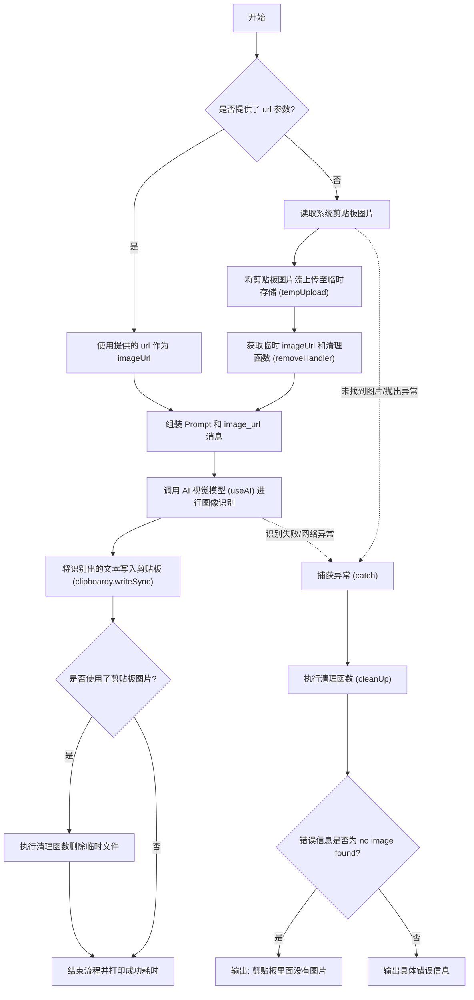

# ai ocr 产品说明书

## 1. 核心价值 (Value Proposition)

为开发者提供一个快捷的图像文字提取工具。通过 AI 视觉模型，自动识别剪贴板或指定 URL 图像中的文本或表格内容，并将其转换为纯文本或 Markdown 格式。免去手动打字录入或寻找第三方 OCR 工具的繁琐步骤，极大地提升日常开发、文档编写和资料整理的效率。

## 2. 用户故事 (User Stories)

-   作为 **开发者或文档编写者**，我希望**提取截图中的文字**，以便于**快速将参考资料粘贴到我的代码注释或设计文档中**。
-   作为 **数据处理人员**，我希望**识别图片中的表格**，以便于**工具能直接输出格式良好的 Markdown 表格，让我能无缝嵌入到 README 或 Wiki 中**。
-   作为 **普通用户**，我希望**直接通过线上图片 URL 提取文字**，以便于**不需要先将图片下载到本地即可进行 OCR 识别**。

## 3. 功能特性 (Features)

-   [x] **多端数据源**：支持直接读取系统剪贴板中的图片，也支持通过传入线上图片 URL 进行识别。
-   [x] **智能表格转换**：针对图片中的表格内容，AI 会自动识别并将其转换为标准 Markdown 格式的表格。
-   [x] **自动排版换行**：智能识别原图中的文本换行情况，并在输出时自动添加 Markdown 换行符。
-   [x] **自动复制**：识别完成后，自动将提取出的文本结果写入系统剪贴板，用户可直接粘贴使用。
-   [x] **自动清理**：若使用了剪贴板图片，上传生成的临时文件会在识别结束后自动销毁，不留垃圾文件。

## 4. 命令行参数 (Command Arguments)

该命令接受以下选项参数：

| 参数名  | 简写 | 类型     | 必填 | 默认值 | 描述                                         |
| :------ | :--- | :------- | :--- | :----- | :------------------------------------------- |
| `--url` | 无   | `string` | 否   | 无     | 线上图片地址。如果不提供，则默认读取剪贴板。 |

## 5. 交互设计 (User Experience)

**输入示例**：

1. 识别剪贴板图片：

```bash
$ mycli ocr
```

2. 识别线上图片：

```bash
$ mycli ocr --url https://example.com/sample.png
```

**预期输出样式**：

_执行中_：

```text
⠋ 正在识别图片
```

_成功输出_：

```text
✔ 识别成功，耗时3.2s，结果已复制到剪贴板
```

_失败输出（剪贴板无图片）_：

```text
✖ 剪贴板里面没有图片
```

## 6. 技术实现 (Technical Implementation)

### 6.1 处理流程图



### 6.2 核心逻辑说明

1. **Prompt 设计**：
   预设了明确的 AI 角色和任务指令：“你是一个图像识别工具。你需要识别用户上传的图像中的文字。如果图像内容是纯文本，就正常输出纯文本；如果图片里的内容是一张表格，请按照markdown格式直接输出表格。如果有识别到文本换行，请添加markdown的换行符。”
2. **图片数据处理**：
    - 剪贴板模式下，先通过 `clipboardy` / `imageClipboard` 读取图片，将其转换为流（`stream`）格式，然后通过 `tempUpload` 临时上传至云端以获取可供 AI 访问的公网 URL。
3. **资源清理 (`cleanUp`)**：
   使用闭包保存了 `tempUpload` 返回的 `removeHandler`，无论识别成功还是发生异常，都会调用该清理函数，以确保临时文件被妥善删除。

## 7. 约束与限制 (Constraints)

-   **网络依赖**：无论是请求 AI 接口还是上传临时图片文件，均需保持良好的网络连接。
-   **剪贴板状态**：当未指定 `--url` 时，系统剪贴板中必须存在有效的图片数据，否则会直接报错退出。
-   **耗时波动**：由于涉及图片上传与大模型视觉推理，执行耗时与图片大小、复杂程度以及当前网络状况强相关。
