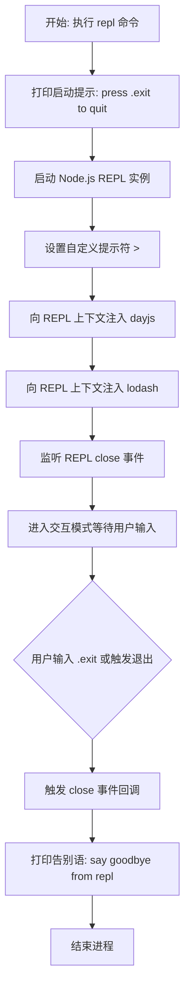

# repl 产品说明书

## 1. 核心价值 (Value Proposition)

提供一个增强版的 Node.js 交互式解释器（REPL）环境。通过预先注入常用的工具库（如 `dayjs` 和 `lodash`），帮助开发者在命令行中更快速、便捷地进行代码实验、数据处理和时间格式化测试，无需手动 require 或 import 这些依赖。

## 2. 用户故事 (User Stories)

- 作为 **Node.js 开发者**，我希望**在一个即开即用的 REPL 环境中直接使用 lodash 方法**，以便于**快速验证数据处理逻辑，而不需要先创建一个临时文件并安装依赖**。
- 作为 **前端/后端开发者**，我希望**能在命令行中快速调用 dayjs 进行时间计算和格式化测试**，以便于**确认时间戳转换或日期推算的结果是否符合预期**。
- 作为 **CLI 工具的用户**，我希望**在退出 REPL 时能有友好的提示**，以便于**明确知道当前会话已经结束**。

## 3. 功能特性 (Features)

- [x] **增强的 REPL 环境**：启动标准的 Node.js REPL，并提供自定义的青色提示符 `>`。
- [x] **内置工具库**：全局上下文中自动注入 `dayjs` 用于日期时间处理。
- [x] **内置工具库**：全局上下文中自动注入 `lodash` 用于复杂的数据结构操作。
- [x] **友好的交互提示**：启动时提示退出快捷键，退出时打印告别语。

## 4. 命令行参数 (Command Arguments)

该命令无需接受任何额外的选项参数，直接运行即可启动。

## 5. 交互设计 (User Experience)

**输入示例**：

```bash
$ mycli repl
```

**预期输出样式**：

```text
press `.exit` to quit
> lodash.camelCase('hello world')
'helloWorld'
> dayjs().format('YYYY-MM-DD')
'2023-10-25'
> .exit
say goodbye from repl
```

## 6. 技术实现 (Technical Implementation)

### 6.1 处理流程图



### 6.2 核心逻辑说明

1. **启动 REPL**：调用 Node.js 原生的 `node:repl` 模块的 `start` 方法。
2. **定制提示符**：使用 `chalk` 将提示符 `>` 设置为青色（cyan），增强视觉体验。
3. **上下文注入**：将引入的 `dayjs` 和 `lodash` 对象直接挂载到 `instance.context` 上，使其在 REPL 会话中作为全局变量可用。
4. **事件监听**：监听 REPL 实例的 `close` 事件，在用户使用 `.exit` 或 `Ctrl+D` 退出时打印黄色的告别语。

## 7. 约束与限制 (Constraints)

- **依赖限制**：当前仅内置了 `dayjs` 和 `lodash`，若需要使用其他第三方库，用户仍需要在当前目录下自行安装并手动引入。
- **环境隔离**：REPL 环境共享启动它的 Node.js 进程的内存和运行环境。
