# sass 产品说明书

## 1. 核心价值 (Value Proposition)

专为微信小程序开发打造的 Sass 编译工具。提供 `.scss` 到 `.wxss` 的实时增量编译、依赖自动追踪和智能热更新，解决原生小程序不支持 Sass 的痛点，提升开发体验与效率。

## 2. 用户故事 (User Stories)

- 作为 **小程序开发者**，我希望 **在保存 scss 文件时自动编译生成 wxss**，以便于 **实时预览样式修改效果**。
- 作为 **小程序开发者**，我希望 **修改公共样式文件（如 `_variables.scss`）时，所有引用它的文件都能自动重新编译**，以便于 **确保全局样式的一致性，无需手动查找和编译依赖文件**。
- 作为 **小程序开发者**，我希望 **工具启动时只编译发生变化的文件（增量编译）**，以便于 **加快启动速度，减少不必要的等待时间**。

## 3. 功能特性 (Features)

- [x] **实时监听**：利用 `chokidar` 监听项目目录下 `.scss` 文件的增删改。
- [x] **智能编译**：自动将 `.scss` 编译为同名的 `.wxss` 文件。
- [x] **依赖追踪**：解析 `@import` 语法，构建文件依赖图谱，实现级联更新。
- [x] **增量构建**：启动时结合 `git diff` 仅编译变更文件。
- [x] **引用识别**：自动识别以 `_` 开头的引用文件（Partial），不单独编译，仅作为依赖源。
- [x] **清理机制**：源文件删除时自动清理对应的编译产物。

## 4. 命令行参数 (Command Arguments)

该命令无特定选项参数，直接运行即可启动监听服务。

```bash
$ mycli sass
```

## 5. 交互设计 (User Experience)

**启动输出**：

```text
编译已变更的scss文件：
src/pages/index/index.scss
sass编译服务已开启。
```

**运行时输出**：

```text
[10:23:45]文件 src/pages/home/home.scss 发生修改
[10:24:00]文件 src/styles/_mixin.scss 发生修改
```

**错误提示**：

```text
编译 src/pages/error/test.scss 失败: Error: Undefined variable.
```

## 6. 技术实现 (Technical Implementation)

### 6.1 处理流程图

```mermaid
graph TD
    A[开始 sassService] --> B[初始化上下文 SassContext]
    B --> C[注册进程退出信号处理]
    C --> D[编译 Git 变更文件 compileChangedFiles]
    D --> E[启动监听服务 startWatcher]
    E --> F[监听文件事件]
    
    F -->|add/新增| G[插入依赖图谱 insertToRepo]
    F -->|unlink/删除| H[处理删除 handleFileUnlink]
    F -->|change/修改| I[处理变更 handleFileChange]
    
    subgraph 处理变更流程
    I --> J[延迟 500ms 避开编辑器锁]
    J --> K[更新依赖关系 updateDependencyRelations]
    K --> L{文件名以 _ 开头?}
    L -- 是 (引用文件) --> M[查找所有依赖此文件的文件]
    M --> N[循环编译所有依赖文件]
    L -- 否 (普通文件) --> O[编译当前文件 compileSassFile]
    end

    subgraph 处理删除流程
    H --> P{文件名以 _ 开头?}
    P -- 是 --> Q[警告：引用文件被删除]
    P -- 否 --> R[删除对应的 .wxss 文件]
    R --> S[更新依赖图 updateDependencyGraph]
    Q --> S
    end
```



### 6.2 核心逻辑说明

1.  **依赖图谱构建 (`insertToRepo`)**：
    -   读取 `.scss` 文件内容，使用正则 `/@import "(.+)"/g` 提取引入路径。
    -   维护 `depRepo` 数组，记录每个文件被哪些文件引用（反向索引），实现修改公共文件时精准触发下游编译。

2.  **增量编译策略**：
    -   启动时调用 `execa('git diff --name-only')` 获取变动文件列表。
    -   过滤出 `.scss` 文件且排除了 `.wxss` 的干扰，仅对这些文件进行首次编译。

3.  **防抖与锁机制**：
    -   在 `handleFileChange` 中设置了 `await sleep(500)`，防止因 VSCode 等编辑器在保存时短暂锁定文件导致读取失败。

## 7. 约束与限制 (Constraints)

-   **环境依赖**：必须在项目根目录下运行，且依赖 `git` 环境进行增量检测。
-   **命名规范**：被引用的 Partial 文件建议遵循 Sass 规范以 `_` 开头（如 `_mixin.scss`），此类文件不会生成独立的 `.wxss`。
-   **编译目标**：强制输出为 `.wxss` 后缀，专用于微信小程序开发，暂不支持配置其他输出后缀。
-   **路径解析**：目前主要支持相对路径的 `@import` 解析，对于复杂的别名路径可能需要额外配置。
