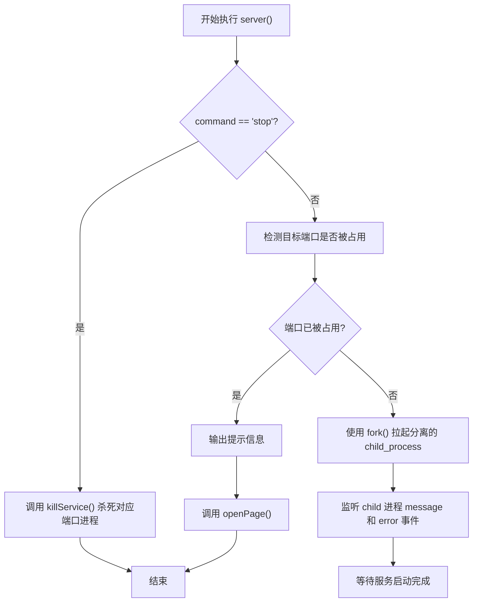
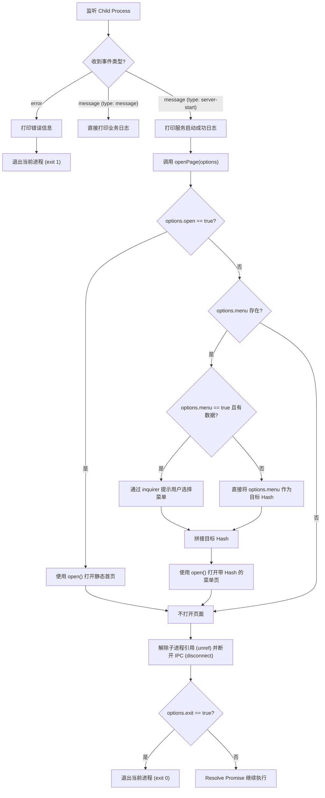

# Server 命令产品文档

## 核心价值 (Value Proposition)
提供一键式本地 Web 服务的启动、停止及页面访问管理能力。开发者无需手动管理后台进程，即可快速拉起后台服务并自动在浏览器中打开指定的静态页面或特定菜单，极大提升了本地开发与预览的效率。

## 用户故事 (User Stories)
- **作为一名开发者**，我希望能够快速启动本地后台服务，以便我能够立刻预览和调试应用。
- **作为一名测试人员**，我希望服务启动后能自动在浏览器中打开特定的功能菜单，而不需要我手动输入 URL 和 Hash。
- **作为一名用户**，我希望能够通过简单的命令停止正在后台运行的本地服务，释放端口占用。
- **作为一名用户**，当服务已经在后台运行时，我希望再次执行启动命令时能够直接帮我打开浏览器，而不是重复启动报错。

## 功能特性 (Features)
- **后台服务管理**：支持以分离 (detached) 模式拉起 Node.js 后台服务，并在控制台显示带时间戳的启动日志。
- **端口检测机制**：启动前自动检测端口占用情况，若服务已在运行，则直接进入页面打开流程。
- **服务停止能力**：支持根据端口精准杀死后台服务进程。
- **智能页面导航**：
  - 支持直接打开系统默认的静态首页。
  - 支持通过交互式命令行选择特定的菜单直接跳转。
  - 支持通过参数直接指定要跳转的菜单 Hash。
- **进程生命周期控制**：服务拉起成功后可配置是否自动退出当前 CLI 进程，保持终端整洁。

## 命令行参数 (Command Arguments)
| 参数/选项 | 类型 | 默认值 | 描述 |
| --- | --- | --- | --- |
| `command` | `string` | `undefined` | 唯一支持的值为 `'stop'`，用于停止后台运行的服务。如果不传，则为启动服务。 |
| `--open` | `boolean` | `false` | 是否在服务启动后（或检测到已启动时）自动打开浏览器访问首页。 |
| `--menu` | `boolean \| string` | `false` | 若为 `true`，通过交互式列表让用户选择要打开的菜单；若为 `string`，直接打开对应 Hash 的菜单。 |
| `--exit` | `boolean` | `false` | 服务启动并打开页面后，是否立即结束当前 CLI 进程。 |

## 交互设计 (User Experience)
- **服务状态提示**：若端口已被占用，输出 `服务已启动，无需重新打开`，并自动执行打开页面的逻辑。
- **日志输出**：服务启动成功时，输出格式化时间戳的黄色日志信息：`[YYYY-MM-DD HH:mm:ss] 服务在XXX端口启动。`
- **菜单选择交互**：当 `--menu` 设置为 `true` 且数据库中存在菜单数据时，使用 `inquirer` 弹出列表供用户使用上下键选择目标菜单。

## 技术实现 (Technical Implementation)

### 1. 主流程分发逻辑 (Main Dispatch Flow)
负责判断用户的命令意图（启动或停止服务）以及服务当前的运行状态。

### 2. 子进程通信与页面打开逻辑 (Sub-Flow: Child Process & Open Page)
负责处理服务实际启动后的消息通信，以及如何根据参数打开特定页面。

## 约束与限制 (Constraints)
- **端口依赖**：强烈依赖 `globalConfig.port.production` 和 `globalConfig.prefix.static` 的配置，修改配置可能导致打开的 URL 错误或端口检测失败。
- **跨平台兼容**：底层使用了 `node:child_process` 的 `fork` 以及 `open` 包，在不同操作系统下的浏览器拉起行为和后台进程管理表现可能存在微小差异。
- **数据库依赖**：菜单列表的获取依赖于 `@cli-tools/shared/utils/sql`，需要确保本地 SQLite 数据库中 `menus` 表的正确初始化。