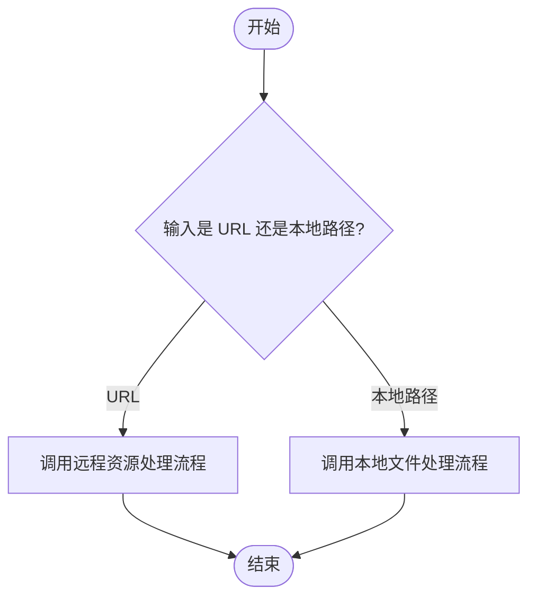
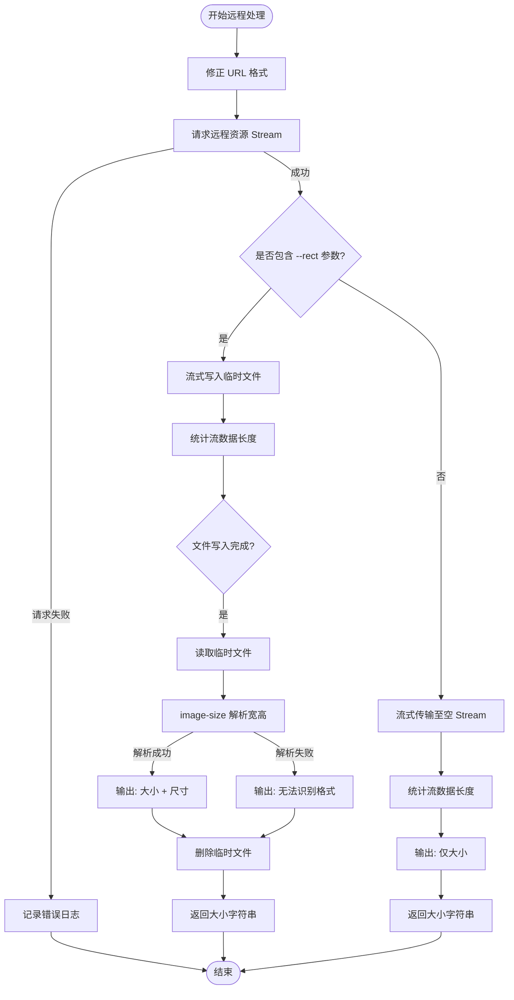
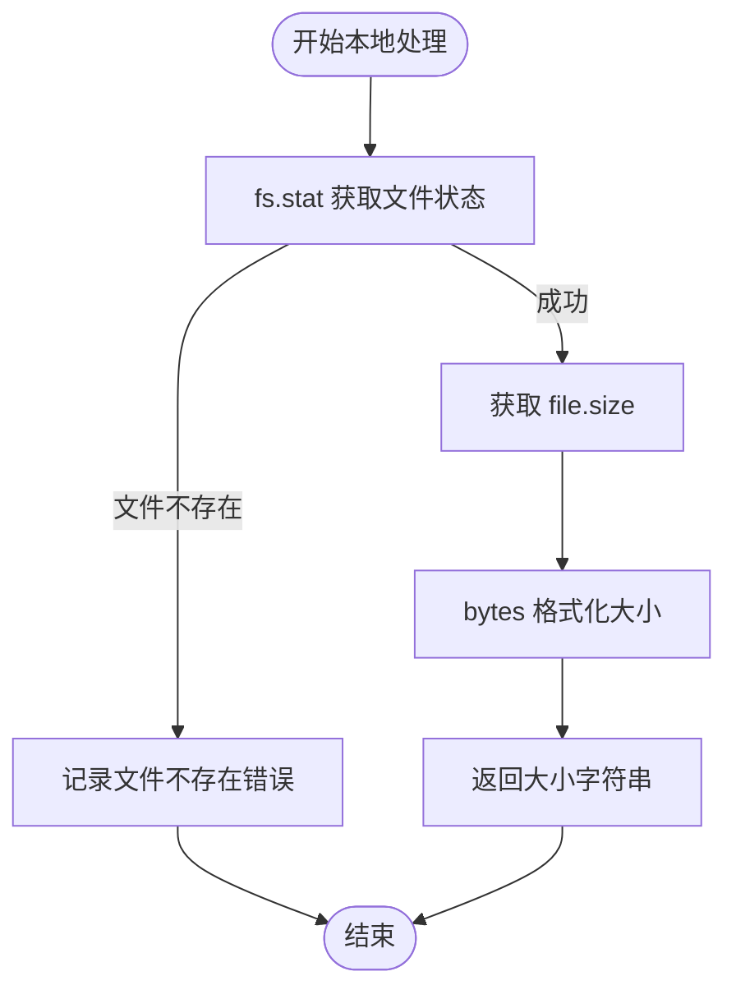

# Size Analysis (Size)

## 核心价值 (Value Proposition)

`size` 命令旨在为开发者提供一个快速、便捷的方式来分析本地文件或远程资源的大小信息。它不仅能显示文件占用的字节数，还能针对远程图片资源进一步解析其尺寸（宽度和高度），省去了手动下载或使用复杂工具查看属性的繁琐步骤。

## 用户故事 (User Stories)

- **场景一：检查本地文件大小**
  作为一名开发者，我想快速知道某个本地构建产物或资源文件的大小，以便评估是否需要进行优化。

- **场景二：分析远程图片资源**
  作为一名前端工程师，我需要确认线上某个图片资源的实际大小和尺寸，而不想手动下载它。我希望通过一个命令直接获取这些信息。

- **场景三：排查资源加载问题**
  当页面加载缓慢时，我怀疑某个远程资源过大。通过 `size` 命令，我可以迅速验证该资源的体积，判断是否为性能瓶颈。

## 功能特性 (Features)

- **本地文件支持**：直接读取并显示本地文件的大小。
- **远程 URL 支持**：自动下载并计算远程文件的大小。
- **图片尺寸解析**：针对远程图片，通过 `--rect` 参数，在计算大小的同时解析并显示图片的宽高等尺寸信息。
- **自动单位转换**：自动将字节数转换为人类可读的格式（如 KB, MB）。

## 交互设计 (User Experience)

### 命令行参数

- **filePath** (必填): 目标文件的路径（本地路径或远程 URL）。
- **--rect** (可选): 仅适用于远程图片 URL。如果指定此参数，将尝试解析并显示图片的尺寸（宽 x 高）。

### 使用示例

1. **查看本地文件大小**
   ```bash
   cli size ./dist/bundle.js
   # 输出: 1.2MB
   ```

2. **查看远程文件大小**
   ```bash
   cli size https://example.com/image.png
   # 输出: 256KB
   ```

3. **查看远程图片大小及尺寸**
   ```bash
   cli size https://example.com/image.png --rect
   # 输出: 大小：256KB，尺寸：800 X 600
   ```

## 技术实现 (Technical Implementation)

`sizeService` 是命令的核心入口，根据输入路径类型分发到不同的处理逻辑。

### 1. 总入口流程 (Main Dispatch Flow)



### 2. 远程资源处理流程 (Remote Resource Flow)

当输入被识别为 URL 时，系统会下载资源并根据参数决定是否解析图片尺寸。



### 3. 本地文件处理流程 (Local File Flow)

当输入被识别为本地文件路径时，系统直接读取文件系统信息。



## 约束与限制 (Constraints)

1. **URL 格式**：远程路径必须是有效的 URL。如果 URL 中包含特殊字符（如未转义的逗号），工具会尝试自动修复，但建议使用标准 URL 编码。
2. **图片格式支持**：`--rect` 参数依赖 `image-size` 库，支持常见的图片格式（JPG, PNG, WEBP, GIF）。不支持的格式将无法解析尺寸。
3. **临时文件**：使用 `--rect` 时会生成临时文件，操作完成后会自动删除。如果程序异常退出，可能会残留临时文件。
4. **返回值一致性**：
   - 远程模式下，服务内部会打印日志。
   - 本地模式下，服务仅返回大小字符串，依赖调用方进行打印（代码逻辑推断）。
