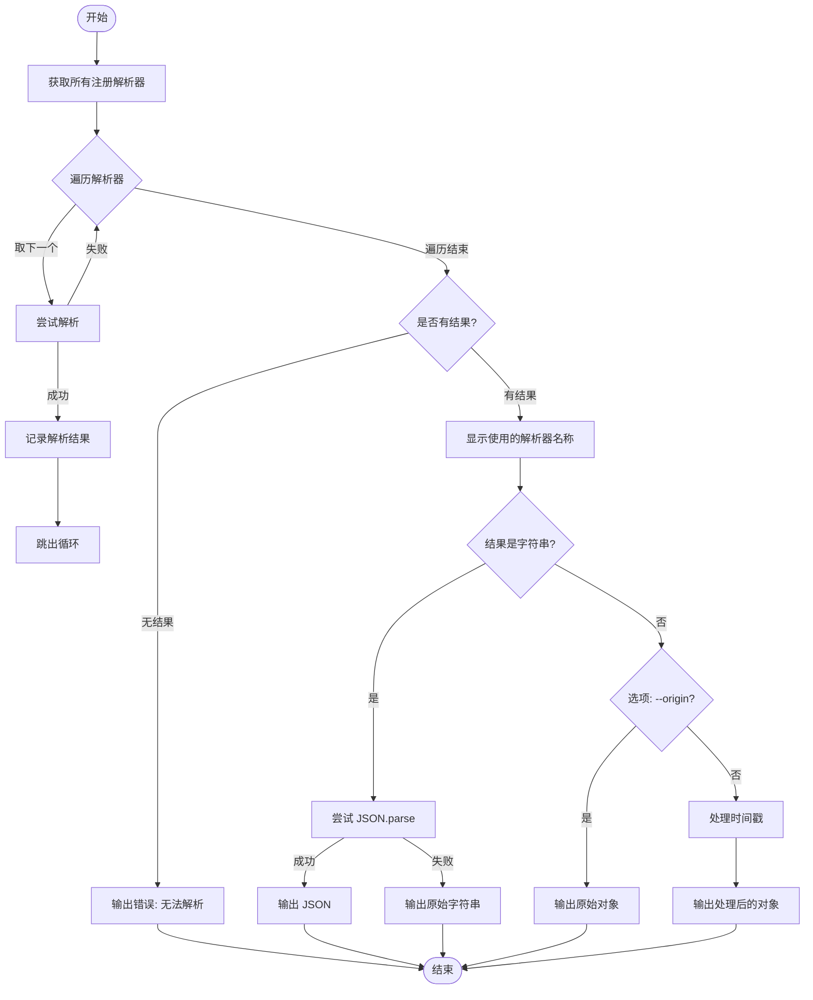
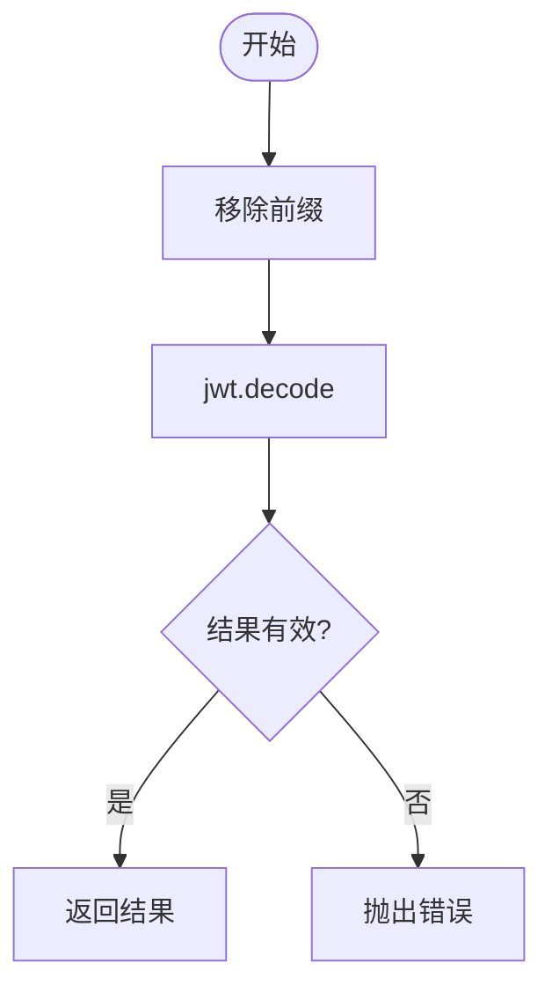
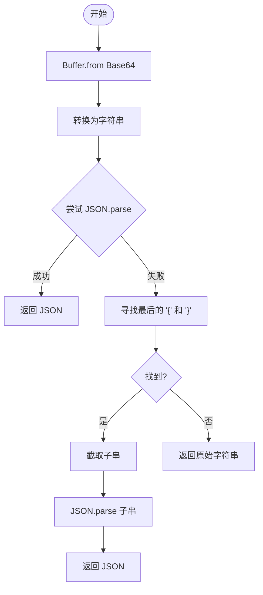

# Token 解析工具 (Token Parser)

## 核心价值 (Value Proposition)

在日常开发中，开发者经常需要处理各种 Token（如 JWT、Base64 编码字符串）。这些 Token 通常是不透明的字符串，包含的关键信息（如过期时间、用户权限）无法直接阅读。手动解码不仅繁琐，而且难以处理时间戳格式转换等细节。

本工具提供了一键式的 Token 解析方案，能够自动识别 Token 类型（JWT 或 Base64），解码并格式化输出内容，同时自动将时间戳转换为人类可读的日期格式，极大地提升了开发调试效率。

## 用户故事 (User Stories)

- **场景一：JWT 调试**
  作为后端开发者，我需要验证前端传来的 JWT Token 中的 `exp`（过期时间）和 `scope`（权限），使用本工具可以直接看到格式化后的 JSON 数据和转换后的过期时间，无需去在线网站解码。

- **场景二：Base64 内容查看**
  作为全栈开发者，我遇到一段 Base64 编码的配置信息，使用本工具可以直接将其解码并作为 JSON 对象显示，方便阅读配置项。

- **场景三：时间戳转换**
  作为测试人员，我拿到一个包含 Unix 时间戳的 Token，使用本工具解析时，所有时间戳字段自动显示为标准日期时间，省去了手动转换的步骤。

## 功能特性 (Features)

- **多策略解析**：内置 JWT 和 Base64 解析器，通过工厂模式管理，易于扩展。
- **智能识别**：自动尝试所有可用解析器，无需用户手动指定 Token 类型。
- **时间戳优化**：自动检测 JSON 值中的 10 位或 13 位时间戳，并转换为本地时间格式（可关闭）。
- **容错处理**：Base64 解析器具备一定的容错能力，能尝试从非标准 JSON 字符串中提取有效 JSON。
- **格式化输出**：解析结果以格式化 JSON 展示，高亮关键信息。

## 交互设计 (User Experience)

用户只需提供 Token 字符串，工具自动完成剩余工作。

- **输入**：`mycli token <token_string>`
- **输出**：
    - 成功：显示解析器名称、格式化的 JSON 数据。
    - 失败：显示错误提示。

支持选项：
- `--origin`：不转换时间戳，保留原始数值。
- `--complete`：显示完整信息（如 JWT 的 Header）。

## 技术实现 (Technical Implementation)

本模块采用**策略模式**和**责任链模式**的思想。核心逻辑在于遍历所有注册的解析器，直到找到一个能够成功解析的解析器。

### 核心流程图 (Main Dispatch Flow)

### 子流程：JWT 解析 (Sub-Flow: JWT Parser)

### 子流程：Base64 解析 (Sub-Flow: Base64 Parser)

### 关键模块说明

1.  **Service (`service.ts`)**: 流程编排者。负责调用 Factory 获取解析器，执行解析循环，以及后置的数据处理（JSON 转换、时间戳处理）。
2.  **Factory (`core/Factory.ts`)**: 注册中心。维护一个 `parsers` Map，提供注册和获取所有解析器的方法。
3.  **Parsers (`implementations/*.ts`)**: 具体策略。
    -   `JwtTokenParser`: 使用 `jsonwebtoken` 库解析，支持 `--complete` 选项。
    -   `Base64TokenParser`: 使用 `Buffer` 解码，并尝试提取 JSON 结构。

## 约束与限制 (Constraints)

1.  **JWT 依赖**: 强依赖 `jsonwebtoken` 库进行 JWT 解析。
2.  **JSON 格式**: Base64 解析器优先尝试解析为 JSON，如果内容不是 JSON 或者是普通字符串，展示效果可能不同。
3.  **时间戳误判**: 简单的数字长度判断（10位或13位）可能会将非时间戳的数字误转换为时间，可以通过 `--origin` 规避。
