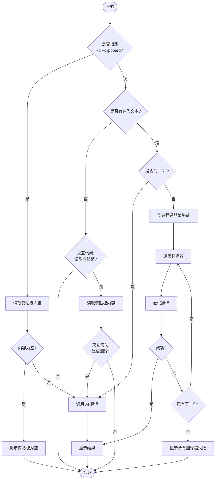

# Translate 模块产品文档

## 1. 核心价值 (Value Proposition)

Translate 模块旨在为开发者提供一个快速、便捷且智能的命令行翻译工具。它解决了开发者在编码或阅读文档时频繁切换窗口查词的痛点，通过集成多种翻译源（有道、AI）和智能剪贴板识别，实现“无缝”的翻译体验。

主要优势：
- **高效便捷**：无需离开终端即可快速获取翻译结果。
- **智能识别**：自动识别中英文、URL，并根据内容类型选择最佳翻译策略。
- **AI 赋能**：集成 AI 翻译能力，能够处理更复杂的长难句和技术文档翻译。
- **剪贴板集成**：支持一键翻译剪贴板内容，极大提升阅读体验。

## 2. 用户故事 (User Stories)

- **场景一：快速查词**
  作为一名开发者，我在阅读源码时遇到一个生僻单词，我希望能在终端直接输入命令查询释义，而不需要打开浏览器。

- **场景二：文档阅读辅助**
  作为一名技术人员，我在浏览英文技术文档时，复制了一段复杂的长句，我希望在终端输入一个简短命令就能自动读取剪贴板内容并给出高质量的 AI 翻译。

- **场景三：网页内容翻译**
  作为一名用户，我有一个英文网页链接，我希望能直接将 URL 喂给翻译工具，它能自动识别并调用 AI 对网页内容进行概括或翻译（注：当前实现为直接翻译 URL 文本，未来可扩展为抓取内容）。

- **场景四：AI 翻译优先**
  作为一名对翻译质量有高要求的用户，我希望能够指定使用 AI 进行翻译，以获得比传统词典更准确的上下文理解。

## 3. 功能特性 (Features)

- **多源翻译策略**：内置有道翻译（基础查词）和 AI 翻译（长文/精准翻译）两种引擎。
- **智能降级与回退**：默认优先使用有道翻译以保证速度，失败时自动降级到 AI 翻译；也可配置为 AI 优先。
- **剪贴板自动读取**：支持 `-c` 参数直接读取剪贴板，或在无输入时交互式询问是否读取。
- **URL 智能识别**：输入 URL 时自动切换为 AI 翻译模式。
- **结果美化**：使用 Box 样式清晰展示翻译结果，区分原文和译文。

## 4. 交互设计 (User Experience)

### 命令行参数

| 参数 | 别名 | 描述 | 默认值 |
| :--- | :--- | :--- | :--- |
| `[text]` | - | 需要翻译的文本 | - |
| `--ai` | - | 是否优先使用 AI 翻译 | `false` |
| `--clipboard` | `-c` | 直接读取剪贴板内容进行翻译 | `false` |

### 交互流程

1. **直接查词**：
   ```bash
   eng hello
   ```
2. **剪贴板翻译**：
   ```bash
   eng -c
   ```
3. **交互式剪贴板**：
   ```bash
   eng
   ? 检测到未输入内容，是否读取剪贴板？ (Y/n)
   ```

## 5. 技术实现 (Technical Implementation)

本模块采用**工厂模式 (Factory Pattern)** 管理翻译器实例，结合**策略模式 (Strategy Pattern)** 实现不同翻译源的切换。

### 核心流程图



### 关键模块说明

- **`service.ts`**: 业务逻辑入口，负责参数解析、流程控制（如剪贴板处理、URL 识别）和翻译器调度。
- **`core/Factory.ts`**: 翻译器工厂，负责根据配置（如 `--ai`）生成翻译器实例数组（策略链）。
- **`core/BaseTranslator.ts`**: 定义翻译器接口 `TranslatorStrategy` 和基础类，确保所有翻译器具有一致的调用方式。
- **`implementations/`**: 具体的翻译器实现，如 `YoudaoTranslator`（调用有道 API）和 `AiTranslator`（调用 LLM）。

## 6. 约束与限制 (Constraints)

- **网络依赖**：所有翻译功能均依赖网络连接，离线状态下无法使用。
- **AI 额度**：AI 翻译依赖后端 LLM 服务，可能受限于 API 额度或响应速度。
- **剪贴板权限**：在某些受限的操作系统环境中，读取剪贴板可能需要用户授权或无法读取。
