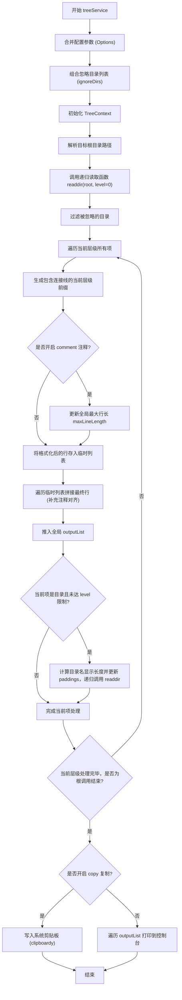

# tree 产品说明书

## 1. 核心价值 (Value Proposition)

提供一个高效、美观的命令行目录树可视化工具，支持自定义遍历深度、文件过滤以及智能的中文字符宽度计算。通过直观展示项目结构，并支持一键复制和自动对齐注释，帮助开发者快速梳理、分享和查阅项目文件组织层级。

## 2. 用户故事 (User Stories)

- 作为 **项目开发者**，我希望 **能够一键生成带有层级结构的目录树文本**，以便于 **在编写项目文档（如 README.md）时直观地展示项目结构**。
- 作为 **代码审查者**，我希望 **过滤掉 `node_modules` 等无关目录，并限制查看的层级深度**，以便于 **快速聚焦于核心源代码的组织情况**。
- 作为 **技术博主**，我希望 **生成的目录树能自动对齐并标注“文件”或“目录”**，以便于 **直接复制到博客文章中，提升代码结构展示的专业度和可读性**。

## 3. 功能特性 (Features)

- [x] **树形可视化**：使用规范的字符绘制清晰的目录层级连接线。
- [x] **深度控制**：支持自定义遍历的层级深度 (`--level`)，控制输出的详细程度。
- [x] **智能过滤**：默认忽略常见的非业务目录（`node_modules`, `.git`, `.DS_Store`），并支持通过 `--ignore` 自定义追加忽略列表。
- [x] **中文字符适配**：内置字符显示长度计算逻辑，完美解决中文文件名的对齐问题。
- [x] **自动注释**：提供 `--comment` 选项，智能计算当前行宽并在末尾自动对齐追加文件或目录类型注释。
- [x] **一键复制**：提供 `--copy` 选项，将生成的树形文本直接写入系统剪贴板，省去手动框选。

## 4. 命令行参数 (Command Arguments)

该命令接受以下选项参数来控制目录树的生成行为：

| 参数名 | 简写 | 类型 | 必填 | 默认值 | 描述 |
| :--- | :--- | :--- | :--- | :--- | :--- |
| `--level` | `-l` | `number` | 否 | `1` | 设置遍历的层级深度。 |
| `--ignore` | `-i` | `string` | 否 | `node_modules,.git,.DS_Store` | 指定要忽略的目录名称，多个目录用逗号分隔。 |
| `--copy` | `-c` | `boolean` | 否 | `false` | 是否将生成的树形文本复制到剪贴板。 |
| `--comment` | 无 | `boolean` | 否 | `false` | 是否在每行末尾添加文件/目录类型注释。 |

## 5. 交互设计 (User Experience)

**输入示例**：

```bash
$ mycli tree ./src --level=2 --comment
```

**预期输出样式**：

```text
src/                        # 目录
├── components/             # 目录
│   ├── Button.tsx        # 文件
│   └── Input.tsx         # 文件
└── utils/                  # 目录
    └── helper.ts           # 文件
```

## 6. 技术实现 (Technical Implementation)

### 6.1 处理流程图



### 6.2 核心逻辑说明

1. **字符宽度计算 (`getDisplayLength`)**：遍历字符串，通过正则 `/[\u4e00-\u9fa5\u3000-\u303f\uff00-\uffef]/` 匹配中文字符。中文计作长度 2，英文计作长度 1，用于在处理多级缩进和注释对齐时精确计算前置占位。
2. **递归层级控制**：`readdir` 递归函数通过 `level` 记录当前深度，并在遍历目录内容前先拦截忽略名单（`ctx.ignoreDirs`）。如果遍历项为目录且 `level < ctx.options.level`，则进入下一层递归。
3. **注释对齐策略**：如果开启了 `--comment`，会在当前层级遍历时收集所有行文本的长度，并更新全局上下文中的 `maxLineLength`。随后统一计算空格补充 (padding) 以确保 `# 目录` 或 `# 文件` 处于同一垂直对齐线上。
4. **输出分发**：所有的目录树文本先保存在 `ctx.outputList` 内存数组中，最终根据 `--copy` 选项决定是借助 `clipboardy` 写入剪贴板，还是直接遍历输出到控制台终端。

## 7. 约束与限制 (Constraints)

- **大目录性能**：对于极深或文件数量庞大的目录，若未限制 `--level` 且未忽略大体积产物目录，频繁的 `fs.readdir` 和 `fs.stat` IO 操作可能会消耗较多内存和时间。
- **系统剪贴板支持**：`--copy` 选项依赖操作系统的剪贴板 API (`clipboardy`)，在某些无桌面环境（如 CI/CD 流水线、SSH 纯终端）中可能会因缺乏剪贴板访问权限而抛出异常。
