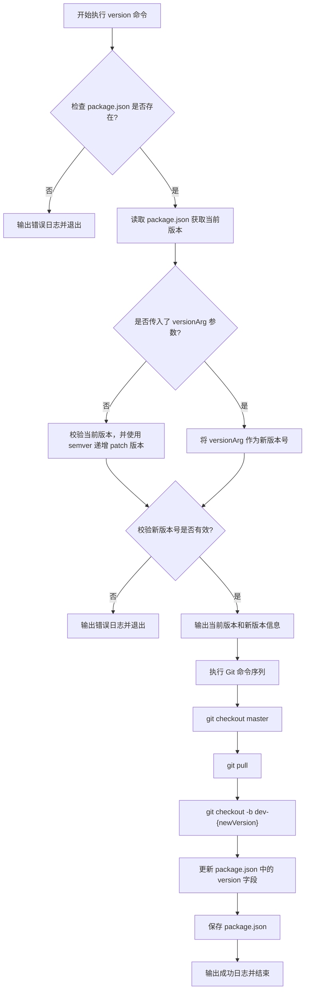

# version 命令产品说明书

## 1. 核心价值 (Value Proposition)

提供便捷的工程版本管理与工作流自动化。通过一条命令自动完成版本号升级、远程主干代码同步以及基于新版本号的开发分支创建，规范团队的发布和日常开发流程，减少手动操作带来的心智负担和出错率。

## 2. 用户故事 (User Stories)

- 作为 **开发者**，我希望在开始新功能开发前，**自动更新 package.json 的版本号并创建对应的开发分支**，以便于**保持版本和分支命名的规范一致性**。
- 作为 **项目维护者**，我希望在准备发布特定新版本时，**能够手动指定特定的版本号，并自动基于最新主干代码创建分支**，以便于**减少繁琐的手动 Git 操作组合**。

## 3. 功能特性 (Features)

- [x] **前置校验**：自动检查当前执行目录下是否存在 `package.json`。
- [x] **版本自增**：在未提供版本参数时，自动读取当前 `package.json` 并增加 `patch` 版本号。
- [x] **指定版本**：支持传入特定版本号，并使用 Semantic Versioning (SemVer) 进行严格的格式校验。
- [x] **主干同步**：自动切换到 `master` 分支并拉取最新代码，确保新分支基于最新、最干净的代码创建。
- [x] **分支创建**：基于新的版本号自动创建并切换到对应的开发分支（如 `dev-1.0.1`）。
- [x] **配置更新**：自动更新并以标准格式保存 `package.json` 文件。

## 4. 命令行参数 (Command Arguments)

该命令接受以下选项参数来控制版本更新行为：

| 参数名 | 简写 | 类型 | 必填 | 默认值 | 描述 |
| :--- | :--- | :--- | :--- | :--- | :--- |
| `versionArg` | 无 | `string` | 否 | 无 | 可选的版本号参数。如果不提供，则默认自动增加当前版本的 `patch` 版本号。 |

**参数逻辑说明**：

- 如果提供了 `versionArg`，则将其作为新版本号，并严格校验其合法性。
- 如果未提供，则读取当前项目版本，并使用 `semver.inc` 自动递增 `patch` 补丁版本。

## 5. 交互设计 (User Experience)

**输入示例 1（自动递增版本）**：

```bash
$ mycli version
```

**输入示例 2（指定特定版本）**：

```bash
$ mycli version 2.0.0
```

**预期输出样式**：

```text
当前版本: 1.0.0
新版本: 1.0.1
正在执行 Git 操作...
成功创建分支 dev-1.0.1 并更新 package.json 版本为 1.0.1
```

## 6. 技术实现 (Technical Implementation)

### 6.1 处理流程图



### 6.2 核心逻辑说明

1. **环境校验**：强依赖当前工作目录 (CWD) 下的 `package.json`，没有该文件直接终止流程。
2. **版本推断**：引入 `semver` 库进行语义化版本的解析、校验与自增运算。
3. **命令组合执行**：使用项目中封装的 `executeCommands` 顺序执行 Git 工作流（切回 `master` -> 拉取最新 -> 基于最新节点创建新分支），确保分支创建环境的绝对一致性。
4. **文件写入**：使用 `fs-extra` 的 `writeJson` 方法，固定使用 4 个空格缩进将新版本写回 `package.json`，保持项目格式整洁。

## 7. 约束与限制 (Constraints)

- **执行目录**：当前工作目录 (CWD) 必须存在有效的 `package.json` 文件。
- **主分支依赖**：内部硬编码了 `master` 分支作为主干分支，如果项目主干分支名为 `main`，执行 Git 切换时将会抛出错误。
- **SemVer 规范**：原有的当前版本和用户输入的新版本都必须严格符合语义化版本规范。
