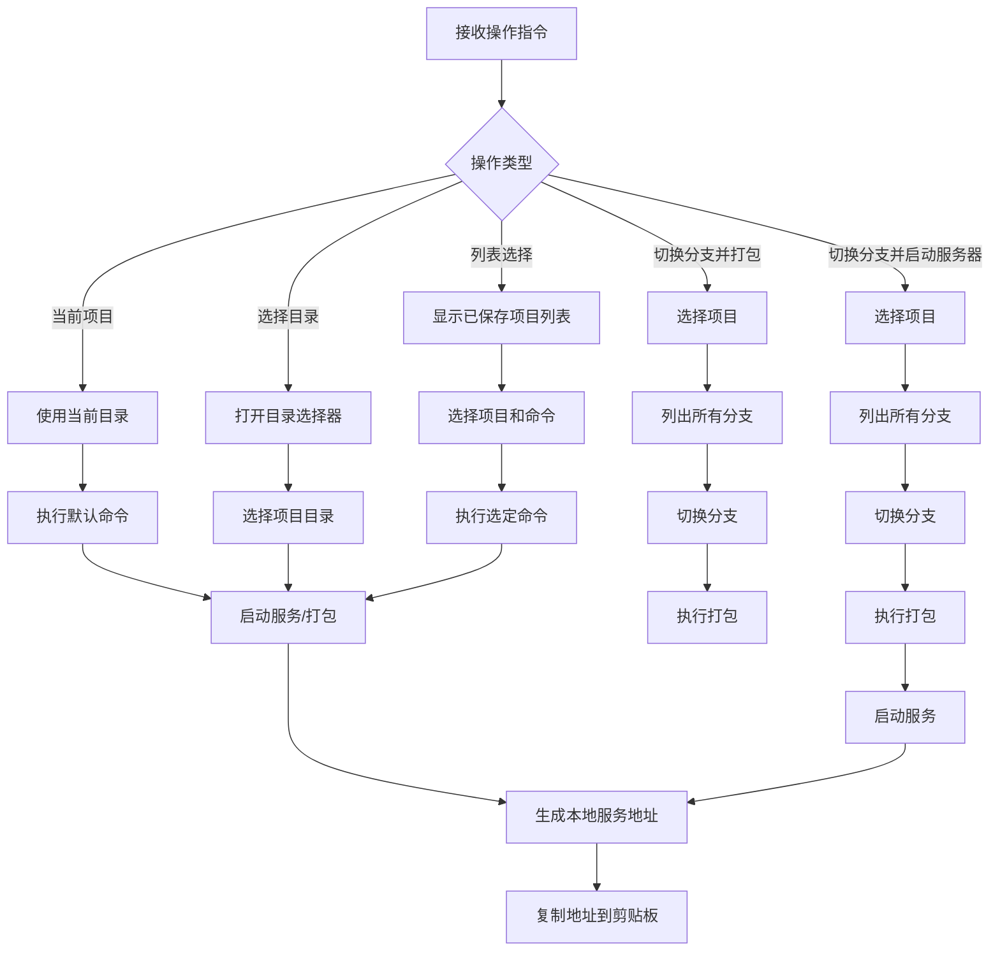

# Vue 项目管理模块

## 功能概述

该模块提供 Vue 项目的快速构建、服务启动和分支管理功能，支持多项目管理和快速部署。

## 实现计划



## API 设计

### 主要方法：`main(options: Options)`

-   参数：
    -   `command`：执行的命令（如 build、serve）
    -   `list`：是否显示已保存项目列表
    -   `server`：是否仅启动服务
    -   `checkoutAndBuild`：是否切换分支并打包
    -   `checkout`：是否切换分支、打包并启动服务器
    -   `current`：是否使用当前项目
    -   `port`：服务启动端口（默认 7001）
    -   `publicPath`：项目公共路径

### 项目管理功能

-   保存项目信息到本地数据库
-   支持多项目快速切换
-   自动检测 Vue 项目配置

## 使用场景

-   快速启动 Vue 项目开发服务器
-   管理多个 Vue 项目
-   快速切换分支并打包
-   自动生成并复制本地服务地址

## 使用示例

```typescript
// 打包当前项目
vue build

// 选择并启动项目
vue --list

// 仅启动服务
vue --server

// 切换分支并打包
vue --checkout-and-build

// 切换分支、打包并启动服务器
vue --checkout
```

## 注意事项

-   需要在 Vue 项目根目录执行
-   依赖项目的 package.json 和 vue.config.js
-   自动处理项目公共路径
-   服务地址自动复制到剪贴板

## server.ts 启动逻辑详解

`server.ts` 是一个独立的 Express 静态文件服务器，通过 `fork` 子进程启动。

### 1. 命令行参数解析

```typescript
const program = new Command();
program.option('--cwd <cwd>', '当前工作目录');
program.option('--publicPath <publicPath>', 'publicPath');
program.option('--port [port]', '端口号');
program.parse(process.argv);
```

-   `--cwd`: 项目的工作目录路径
-   `--publicPath`: 静态资源的公共路径（如 `/app/`）
-   `--port`: 指定端口号（可选，默认 7001）

### 2. 端口检测

```typescript
const port = await detectPort(options.port || 7001);
```

-   使用 `detect-port` 库检测端口是否被占用
-   如果指定端口被占用，会自动选择下一个可用端口
-   避免端口冲突

### 3. 静态文件服务配置

```typescript
app.use(options.publicPath, express.static(join(options.cwd, 'dist')));
```

-   将 `项目路径/dist` 目录作为静态文件服务
-   通过 `publicPath` 路径访问（如访问 `/app/` 时返回 dist 内的文件）
-   支持 HTML、CSS、JS、图片等静态资源

### 4. 启动服务器并通知父进程

```typescript
app.listen(port, () => {
    process.send?.({
        port,
    });
});
```

-   启动 Express 服务器监听指定端口
-   **关键点**：通过 `process.send()` 向父进程发送消息，包含实际使用的端口
-   父进程（`index.ts`）监听这个消息来获取端口并生成访问 URL

### 完整启动流程

```
父进程 (index.ts)                     子进程 (server.ts)
    │                                      │
    │ 1. fork()                            │
    ├─────────────────────────────────────>│
    │                                      │ 2. 解析命令行参数
    │                                      │    --cwd, --publicPath, --port
    │                                      │
    │                                      │ 3. 检测可用端口
    │                                      │    detectPort(7001)
    │                                      │
    │                                      │ 4. 配置静态文件服务
    │                                      │    app.use(publicPath, static(dist))
    │                                      │
    │                                      │ 5. 启动服务器
    │                                      │    app.listen(port)
    │                                      │
    │ 6. 接收消息 {port}                    │
    │    child.on('message')               │
    │                                      │
    │ 7. 生成完整 URL                        │
    │    http://192.168.1.x:port/publicPath
    │                                      │
    │ 8. 复制到剪贴板                        │
    │    clipboardy.writeSync(url)         │
    │                                      │
    │ 9. 主进程退出                          │
    │    process.exit(0)                   │
    │                                      │ (子进程继续运行)
```

### 关键设计点

1. **子进程分离** (`detached: true`)

    - 子进程独立运行，主进程退出后服务仍可用
    - 适合长时间运行的开发服务器

2. **IPC 通信** (`stdio: [null, null, null, 'ipc']`)

    - 通过 IPC 通道传递端口信息
    - 主进程获取端口后即可退出，无需等待服务关闭

3. **自动端口检测**

    - 避免端口冲突，提升用户体验
    - 自动选择可用端口

4. **URL 自动复制**
    - 生成完整的访问地址（含内网 IP）
    - 自动复制到剪贴板，方便浏览器访问

这个设计将**服务启动**和**主进程控制**分离，主进程只负责配置和启动，子进程负责实际的服务运行，是一种优雅的架构设计。
