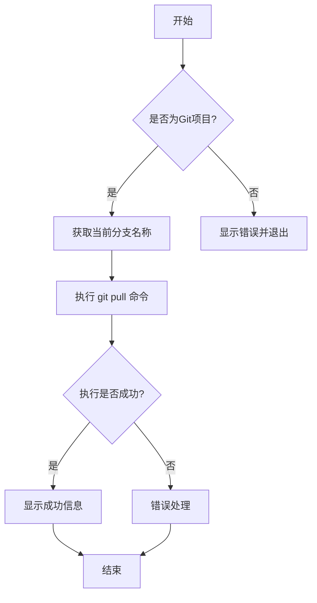

# git pull 命令实现计划

## 功能概述

`git pull` 命令用于从远程仓库获取最新代码并合并到本地分支，该命令实现以下功能：

1. 拉取当前分支对应的远程分支的最新代码
2. 自动处理可能的冲突情况

## 实现细节

1. 检查当前目录是否是 Git 项目
2. 获取当前分支名称
3. 执行 git pull 命令
4. 使用 gitAtom 模块处理命令执行和错误处理
5. 展示适当的反馈信息

## 选项说明

该命令不需要额外参数。

## 错误处理

处理以下可能出现的错误：

-   当前目录不是 Git 项目
-   无法获取当前分支名称
-   拉取过程中出现的网络错误或权限问题
-   代码合并冲突（gitAtom.pull 方法会自动处理）
