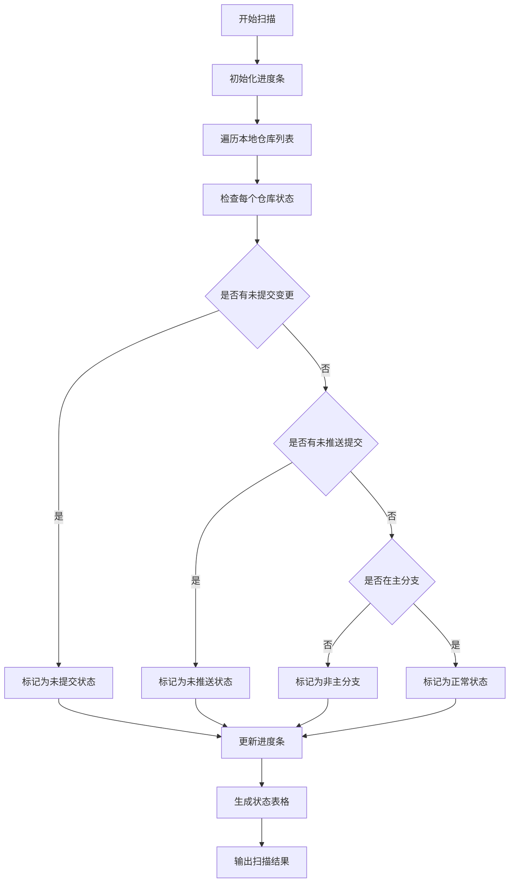

# Git 仓库扫描模块

## 功能概述

该模块提供对本地 Git 仓库的批量状态扫描功能，可以快速检查多个仓库的提交、推送和分支状态。

## 实现计划

## API 设计

### 主要方法：`main()`

-   无参数
-   功能：
    -   扫描本地所有 Git 仓库
    -   检查每个仓库的状态
    -   生成并展示状态报告

### 状态映射

-   1：未提交
-   2：未推送
-   3：正常
-   4：不在主分支上

## 使用场景

-   批量检查多个项目的 Git 仓库状态
-   快速定位需要提交、推送或切换分支的仓库

## 注意事项

-   需要在包含多个 Git 仓库的父目录中运行
-   扫描过程会显示进度条
-   输出结果包括仓库名称、路径和状态
