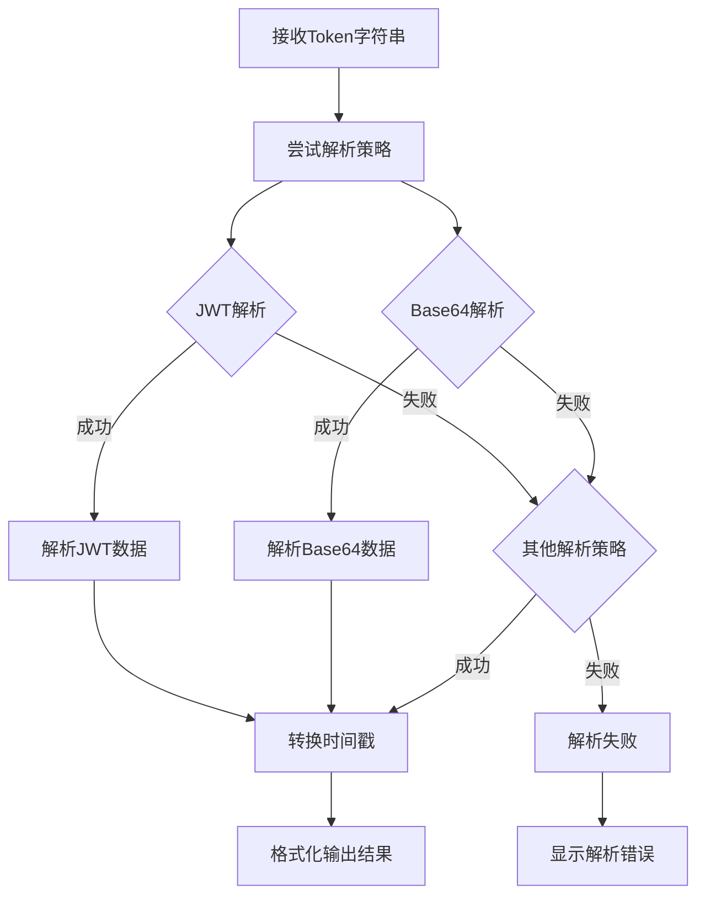

# Token 解析模块

## 功能概述

该模块提供多策略的 Token 解析功能，支持 JWT、Base64 等多种 Token 解析方式，并提供友好的解析结果展示。

## 实现计划



## API 设计

### 主要方法：`main(tk: string, options: Options)`

-   参数：
    -   `tk`：待解析的 Token 字符串
    -   `options`：解析配置选项
        -   `origin`：是否保留原始时间戳
        -   `complete`：是否显示完整解析信息

### 解析策略

-   JWT 解析
-   Base64 解析
-   自动选择最匹配的解析方式

## 使用场景

-   快速解析和查看 Token 内容
-   调试 JWT Token
-   解码 Base64 编码的 Token

## 使用示例

```typescript
// 解析 JWT Token
token 'eyJhbGciOiJIUzI1NiIsInR5cCI6IkpXVCJ9...'

// 显示完整 Token 信息
token 'token' --complete

// 保留原始时间戳
token 'token' --origin
```

## 注意事项

-   支持多种 Token 解析策略
-   自动转换时间戳为可读格式
-   解析失败时给出友好提示
