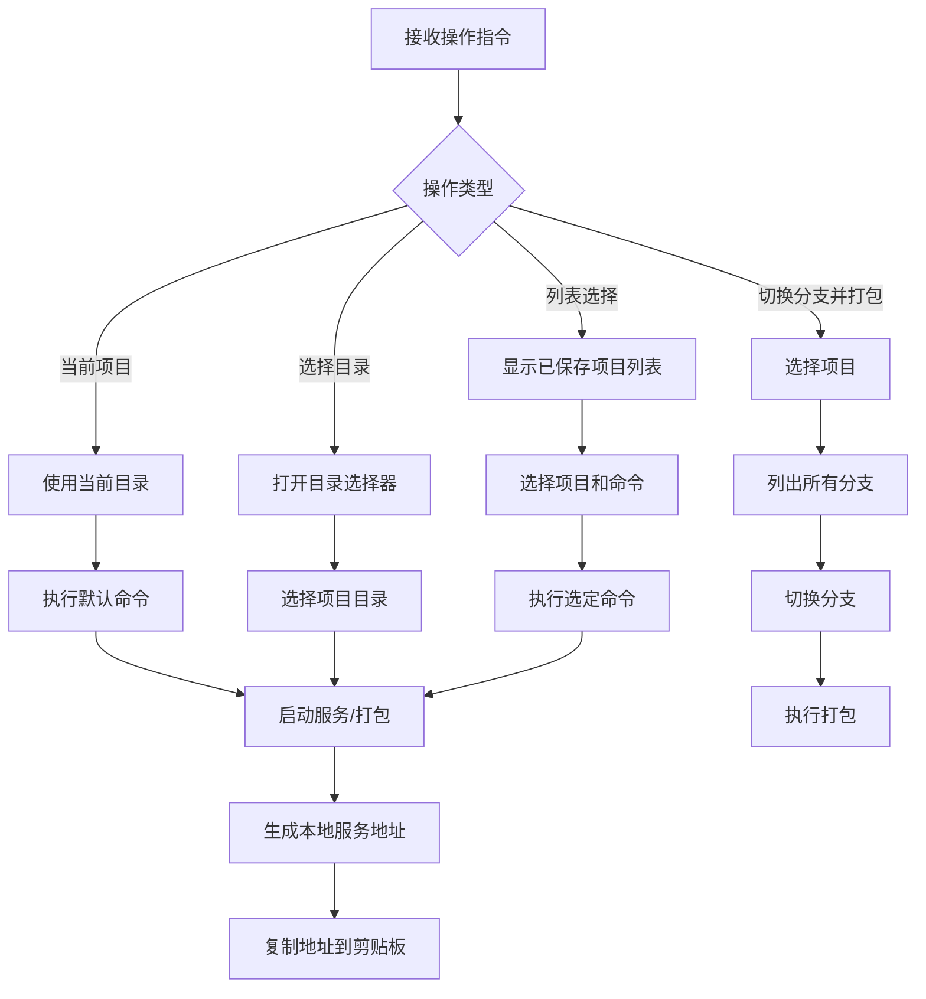

# Vue 项目管理模块

## 功能概述

该模块提供 Vue 项目的快速构建、服务启动和分支管理功能，支持多项目管理和快速部署。

## 实现计划



## API 设计

### 主要方法：`main(options: Options)`

-   参数：
    -   `command`：执行的命令（如 build、serve）
    -   `list`：是否显示已保存项目列表
    -   `server`：是否仅启动服务
    -   `checkoutAndBuild`：是否切换分支并打包
    -   `current`：是否使用当前项目
    -   `port`：服务启动端口（默认 7001）
    -   `publicPath`：项目公共路径

### 项目管理功能

-   保存项目信息到本地数据库
-   支持多项目快速切换
-   自动检测 Vue 项目配置

## 使用场景

-   快速启动 Vue 项目开发服务器
-   管理多个 Vue 项目
-   快速切换分支并打包
-   自动生成并复制本地服务地址

## 使用示例

```typescript
// 打包当前项目
vue build

// 选择并启动项目
vue --list

// 仅启动服务
vue --server

// 切换分支并打包
vue --checkout-and-build
```

## 注意事项

-   需要在 Vue 项目根目录执行
-   依赖项目的 package.json 和 vue.config.js
-   自动处理项目公共路径
-   服务地址自动复制到剪贴板
