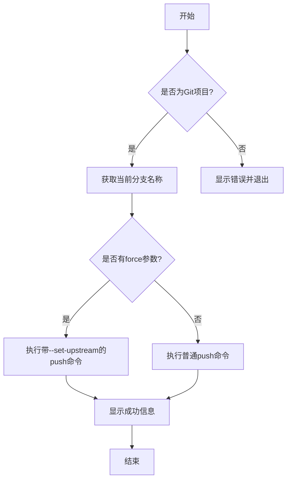

# git push 命令实现计划

## 功能概述

`git push` 命令用于将本地分支的更新推送到远程仓库，支持以下功能：

1. 推送当前分支到远程同名分支
2. 通过 force 参数设置上游分支

## 实现细节

1. 检查当前目录是否是 Git 项目
2. 获取当前分支名称
3. 根据 force 参数选择执行策略
    - 如果 force 为 true，则执行 `git push --set-upstream origin {branchName}`
    - 如果 force 为 false，则执行普通的 `git push`
4. 使用 gitAtom 模块处理命令执行和错误处理
5. 展示适当的反馈信息

## 选项说明

-   `force`：设置为 true 时，执行 `git push --set-upstream origin {branchName}`，默认为 false

## 错误处理

处理以下可能出现的错误：

-   当前目录不是 Git 项目
-   无法获取当前分支名称
-   推送过程中出现的网络错误或权限问题
-   远程拒绝推送（例如非快进合并）
