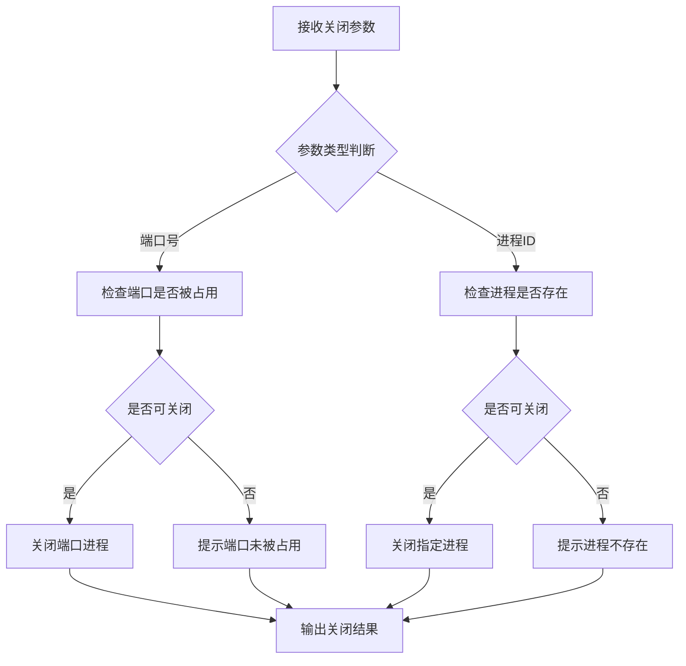

# 进程/端口关闭模块

## 功能概述

该模块提供灵活的进程和端口关闭功能，支持通过进程 ID 或端口号终止运行中的进程。

## 实现计划



## API 设计

### 主要方法：`main(...args: any[])`

-   参数：
    -   支持多种调用方式
        1. `port`：直接传入端口号
        2. `'port', portNumber`：显式指定关闭端口
        3. `'pid', processId`：显式指定关闭进程
-   可选配置项：
    -   `log`：是否打印日志（默认 true）

### 参数校验规则

-   仅接受 1000 以上的端口号或进程 ID
-   检查端口/进程是否实际被占用

## 使用场景

-   快速终止占用特定端口的进程
-   根据进程 ID 关闭指定进程
-   批量管理系统进程

## 使用示例

```typescript
// 关闭 7001 端口
kill 7001

// 关闭指定进程ID
kill pid 12345

// 关闭端口，不打印日志
kill port 8080 { log: false }
```

## 注意事项

-   谨慎使用，可能会意外终止重要进程
-   仅支持关闭本机进程
-   需要足够的系统权限
